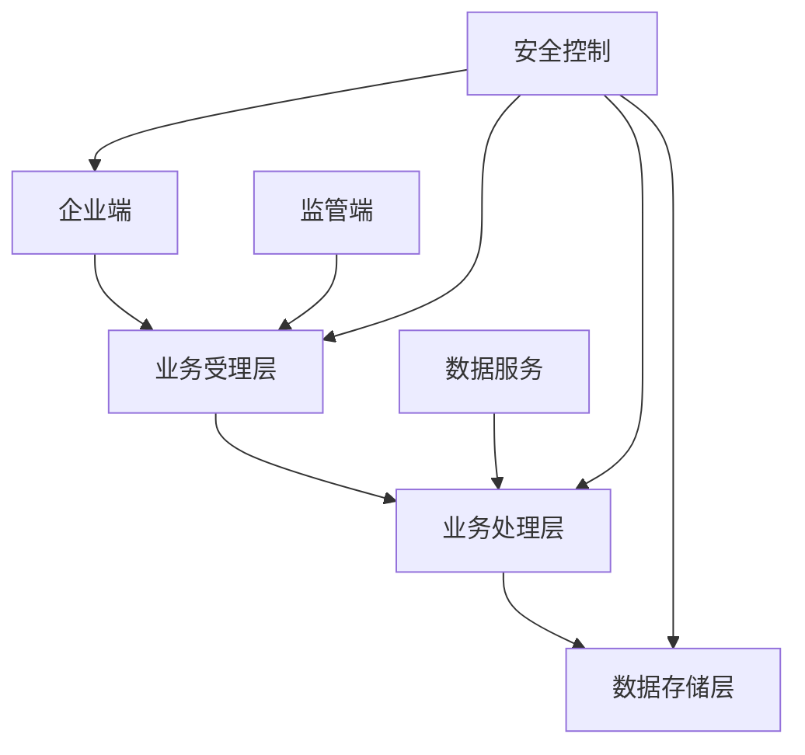

# 化妆品监管模块详细设计方案

## 1. 总体架构设计

### 1.1 逻辑架构


### 1.2 功能架构

#### 1.2.1 企业服务功能
- 企业注册认证
- 备案申请管理
- 许可申请管理
- 监管信息查询
- 风险预警查询

#### 1.2.2 监管服务功能
- 备案审核管理
- 许可审批管理
- 监督检查管理
- 风险监测管理
- 统计分析管理

#### 1.2.3 系统管理功能
- 用户权限管理
- 基础数据管理
- 系统配置管理
- 日志审计管理

### 1.3 技术架构
- 前端：React + Ant Design Pro
- 后端：Spring Cloud微服务
- 数据库：MySQL + MongoDB
- 缓存：Redis
- 消息：RabbitMQ
- 搜索：Elasticsearch

## 2. 数据库详细设计

### 2.1 企业信息表
```sql
-- 企业基本信息
CREATE TABLE t_enterprise (
    id VARCHAR(32) PRIMARY KEY,
    credit_code VARCHAR(32) NOT NULL COMMENT '统一社会信用代码',
    enterprise_name VARCHAR(200) NOT NULL COMMENT '企业名称',
    legal_person VARCHAR(50) NOT NULL COMMENT '法定代表人',
    contact_person VARCHAR(50) COMMENT '联系人',
    contact_phone VARCHAR(20) COMMENT '联系电话',
    address TEXT COMMENT '企业地址',
    business_scope TEXT COMMENT '经营范围',
    register_date DATE COMMENT '注册日期',
    status VARCHAR(20) COMMENT '状态',
    create_time DATETIME COMMENT '创建时间',
    update_time DATETIME COMMENT '更新时间'
);

-- 企业资质信息
CREATE TABLE t_enterprise_qualification (
    id VARCHAR(32) PRIMARY KEY,
    enterprise_id VARCHAR(32) NOT NULL COMMENT '企业ID',
    qual_type VARCHAR(50) NOT NULL COMMENT '资质类型',
    qual_number VARCHAR(50) NOT NULL COMMENT '资质编号',
    valid_date DATE COMMENT '有效期',
    issue_date DATE COMMENT '发证日期',
    issue_org VARCHAR(100) COMMENT '发证机关',
    status VARCHAR(20) COMMENT '状态',
    create_time DATETIME COMMENT '创建时间',
    update_time DATETIME COMMENT '更新时间'
);
```

### 2.2 产品信息表
```sql
-- 产品基本信息
CREATE TABLE t_product (
    id VARCHAR(32) PRIMARY KEY,
    product_name VARCHAR(200) NOT NULL COMMENT '产品名称',
    product_code VARCHAR(50) NOT NULL COMMENT '产品编码',
    category_code VARCHAR(50) COMMENT '分类编码',
    specification TEXT COMMENT '规格型号',
    manufacturer_id VARCHAR(32) COMMENT '生产企业ID',
    storage_condition TEXT COMMENT '贮存条件',
    shelf_life VARCHAR(50) COMMENT '保质期',
    status VARCHAR(20) COMMENT '状态',
    create_time DATETIME COMMENT '创建时间',
    update_time DATETIME COMMENT '更新时间'
);

-- 产品原料信息
CREATE TABLE t_product_material (
    id VARCHAR(32) PRIMARY KEY,
    product_id VARCHAR(32) NOT NULL COMMENT '产品ID',
    material_name VARCHAR(100) NOT NULL COMMENT '原料名称',
    material_code VARCHAR(50) COMMENT '原料编码',
    content VARCHAR(50) COMMENT '含量',
    purpose VARCHAR(200) COMMENT '使用目的',
    status VARCHAR(20) COMMENT '状态',
    create_time DATETIME COMMENT '创建时间',
    update_time DATETIME COMMENT '更新时间'
);
```

### 2.3 监管信息表
```sql
-- 检查记录
CREATE TABLE t_check_record (
    id VARCHAR(32) PRIMARY KEY,
    enterprise_id VARCHAR(32) NOT NULL COMMENT '企业ID',
    check_type VARCHAR(50) NOT NULL COMMENT '检查类型',
    check_date DATE NOT NULL COMMENT '检查日期',
    inspector VARCHAR(50) COMMENT '检查人员',
    check_result TEXT COMMENT '检查结果',
    issue_desc TEXT COMMENT '问题描述',
    handle_measure TEXT COMMENT '处理措施',
    status VARCHAR(20) COMMENT '状态',
    create_time DATETIME COMMENT '创建时间',
    update_time DATETIME COMMENT '更新时间'
);

-- 整改记录
CREATE TABLE t_rectification (
    id VARCHAR(32) PRIMARY KEY,
    check_id VARCHAR(32) NOT NULL COMMENT '检查记录ID',
    enterprise_id VARCHAR(32) NOT NULL COMMENT '企业ID',
    rect_content TEXT NOT NULL COMMENT '整改内容',
    deadline DATE COMMENT '整改期限',
    complete_time DATE COMMENT '完成时间',
    verify_result TEXT COMMENT '验收结果',
    status VARCHAR(20) COMMENT '状态',
    create_time DATETIME COMMENT '创建时间',
    update_time DATETIME COMMENT '更新时间'
);
```

### 2.4 风险信息表
```sql
-- 风险预警
CREATE TABLE t_risk_warning (
    id VARCHAR(32) PRIMARY KEY,
    risk_type VARCHAR(50) NOT NULL COMMENT '风险类型',
    risk_level VARCHAR(20) NOT NULL COMMENT '风险等级',
    warning_content TEXT NOT NULL COMMENT '预警内容',
    source VARCHAR(50) COMMENT '来源',
    issue_time DATETIME COMMENT '发布时间',
    status VARCHAR(20) COMMENT '状态',
    create_time DATETIME COMMENT '创建时间',
    update_time DATETIME COMMENT '更新时间'
);

-- 风险处置
CREATE TABLE t_risk_disposal (
    id VARCHAR(32) PRIMARY KEY,
    warning_id VARCHAR(32) NOT NULL COMMENT '预警ID',
    disposal_type VARCHAR(50) NOT NULL COMMENT '处置类型',
    disposal_content TEXT NOT NULL COMMENT '处置内容',
    handler VARCHAR(50) COMMENT '处置人',
    handle_time DATETIME COMMENT '处置时间',
    handle_result TEXT COMMENT '处置结果',
    status VARCHAR(20) COMMENT '状态',
    create_time DATETIME COMMENT '创建时间',
    update_time DATETIME COMMENT '更新时间'
);
```

## 3. 接口详细设计

### 3.1 企业服务接口
```
// 企业注册
POST /api/v1/enterprise/register
Request: {
    credit_code: string,     // 统一社会信用代码
    enterprise_name: string, // 企业名称
    legal_person: string,    // 法定代表人
    contact_info: object,    // 联系信息
    business_info: object   // 经营信息
}
Response: {
    enterprise_id: string,  // 企业ID
    status: string        // 注册状态
}

// 资质申请
POST /api/v1/enterprise/qualification/apply
Request: {
    enterprise_id: string,  // 企业ID
    qual_type: string,     // 资质类型
    materials: array      // 申请材料
}
Response: {
    application_id: string, // 申请ID
    status: string        // 申请状态
}
```

### 3.2 监管服务接口
```
// 检查任务分派
POST /api/v1/supervision/check/assign
Request: {
    enterprise_id: string,  // 企业ID
    check_type: string,    // 检查类型
    check_items: array,   // 检查项目
    inspector: string     // 检查人员
}
Response: {
    task_id: string,     // 任务ID
    status: string      // 任务状态
}

// 检查结果上报
POST /api/v1/supervision/check/report
Request: {
    task_id: string,      // 任务ID
    check_result: object, // 检查结果
    issues: array,       // 发现问题
    measures: array      // 处理措施
}
Response: {
    record_id: string,   // 记录ID
    status: string      // 处理状态
}
```

### 3.3 风险监测接口
```
// 风险预警发布
POST /api/v1/risk/warning/publish
Request: {
    risk_type: string,    // 风险类型
    risk_level: string,   // 风险等级
    content: string,     // 预警内容
    targets: array      // 预警对象
}
Response: {
    warning_id: string, // 预警ID
    status: string     // 发布状态
}

// 风险处置反馈
POST /api/v1/risk/disposal/feedback
Request: {
    warning_id: string,    // 预警ID
    disposal_type: string, // 处置类型
    content: string,      // 处置内容
    result: object       // 处置结果
}
Response: {
    disposal_id: string, // 处置ID
    status: string      // 处理状态
}
```

## 4. 安全设计方案

### 4.1 访问控制
1. 身份认证
   - 账号密码认证
   - 数字证书认证
   - 短信验证码认证
   - 生物特征认证

2. 权限管理
   - 角色权限控制
   - 数据权限控制
   - 功能权限控制
   - 审批权限控制

### 4.2 数据安全
1. 数据传输安全
   - HTTPS加密传输
   - 数据签名验证
   - 防重放攻击
   - 时间戳校验

2. 数据存储安全
   - 敏感数据加密
   - 数据访问控制
   - 数据备份恢复
   - 数据容灾保护

### 4.3 安全审计
1. 操作审计
   - 用户操作日志
   - 系统操作日志
   - 数据操作日志
   - 安全事件日志

2. 安全监控
   - 实时监控告警
   - 异常行为检测
   - 安全事件分析
   - 审计报告生成

## 5. 部署方案

### 5.1 部署架构
1. 应用服务器
   - Web服务器集群
   - 应用服务器集群
   - 文件服务器集群
   - 缓存服务器集群

2. 数据库服务器
   - 主从数据库集群
   - 读写分离部署
   - 数据备份服务器
   - 容灾备份服务器

### 5.2 网络部署
1. 网络分区
   - DMZ区
   - 应用区
   - 数据区
   - 管理区

2. 安全部署
   - 防火墙部署
   - IDS/IPS部署
   - VPN部署
   - 漏洞扫描部署

## 6. 性能优化方案

### 6.1 系统性能
1. 应用性能
   - 代码优化
   - 缓存优化
   - 并发优化
   - 负载均衡

2. 数据性能
   - SQL优化
   - 索引优化
   - 分库分表
   - 读写分离

### 6.2 监控预警
1. 性能监控
   - 系统资源监控
   - 应用性能监控
   - 数据库监控
   - 网络监控

2. 预警处理
   - 性能预警
   - 容量预警
   - 故障预警
   - 安全预警