# 各子系统数据流转图设计

## 1. 化妆品注册人备案人信息档案系统数据流转

### 1.1 主数据流
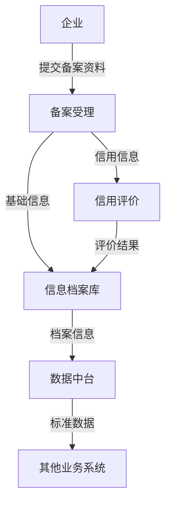

### 1.2 信息归集流
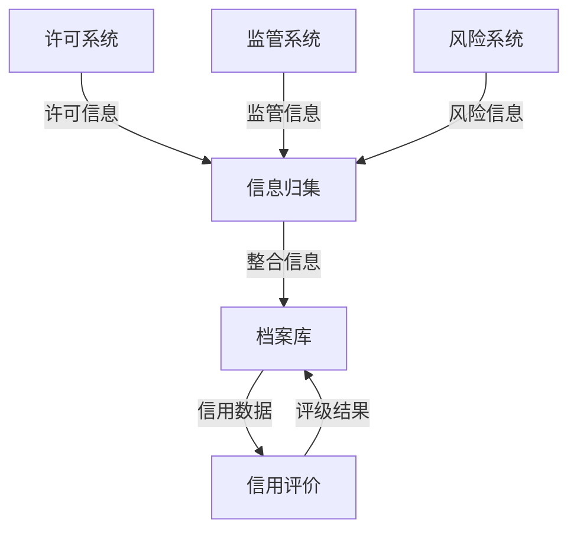

## 2. 化妆品许可系统数据流转

### 2.1 许可审批流
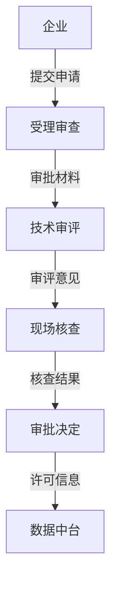

### 2.2 许可监管流
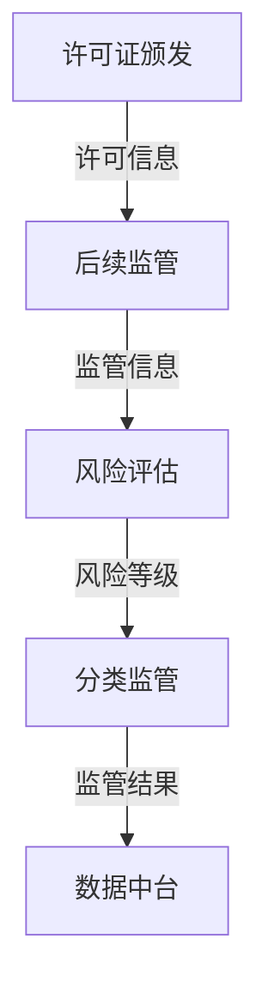

## 3. 化妆品监管系统数据流转

### 3.1 日常监管流
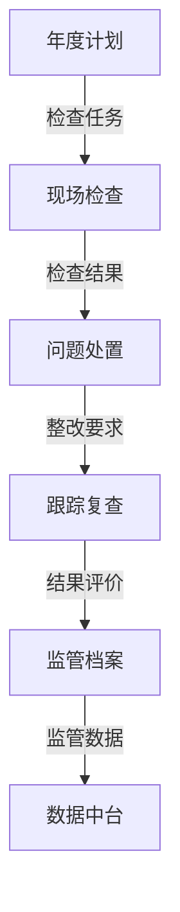

### 3.2 专项检查流
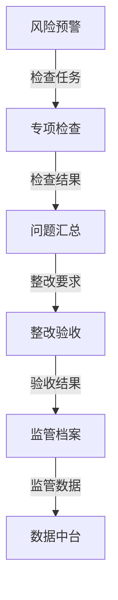

## 4. 化妆品分级分类系统数据流转

### 4.1 分级评定流
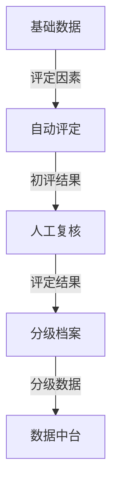

### 4.2 分类管理流
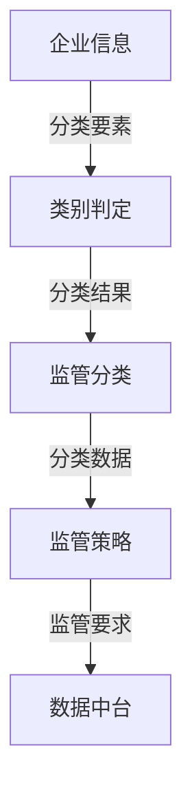

## 5. 化妆品召回销毁系统数据流转

### 5.1 召回流程
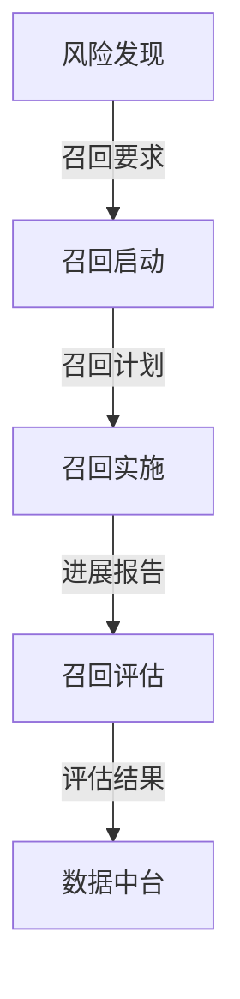

### 5.2 销毁流程
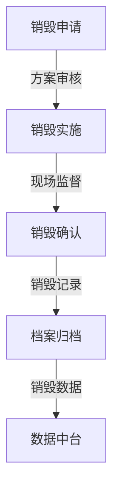

## 6. 化妆品风险监管系统数据流转

### 6.1 风险监测流
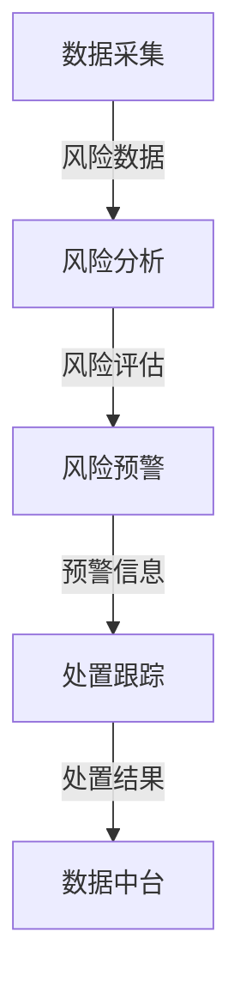

### 6.2 应急处置流
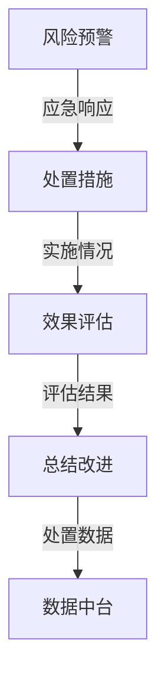

## 7. 化妆品培训考试系统数据流转

### 7.1 培训流程
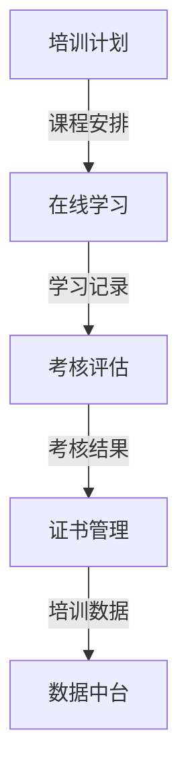

### 7.2 考试流程
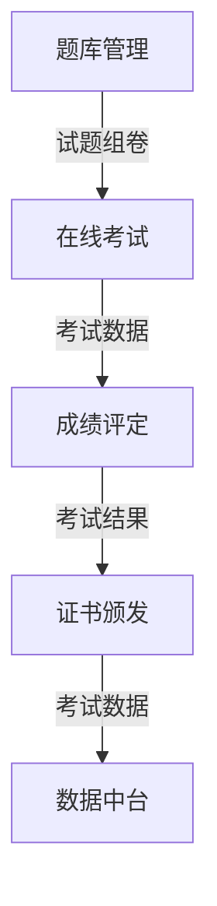

## 8. 化妆品监管一张图数据流转

### 8.1 数据汇聚流
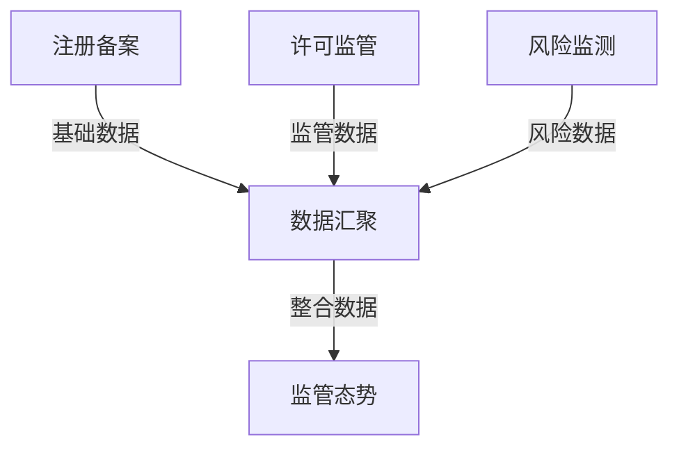

### 8.2 数据展示流
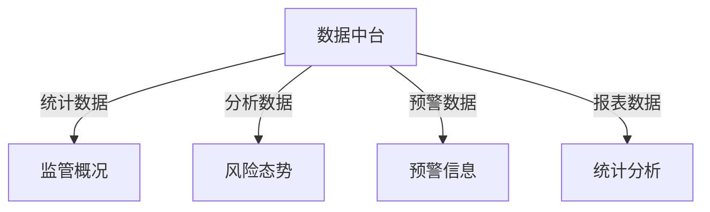