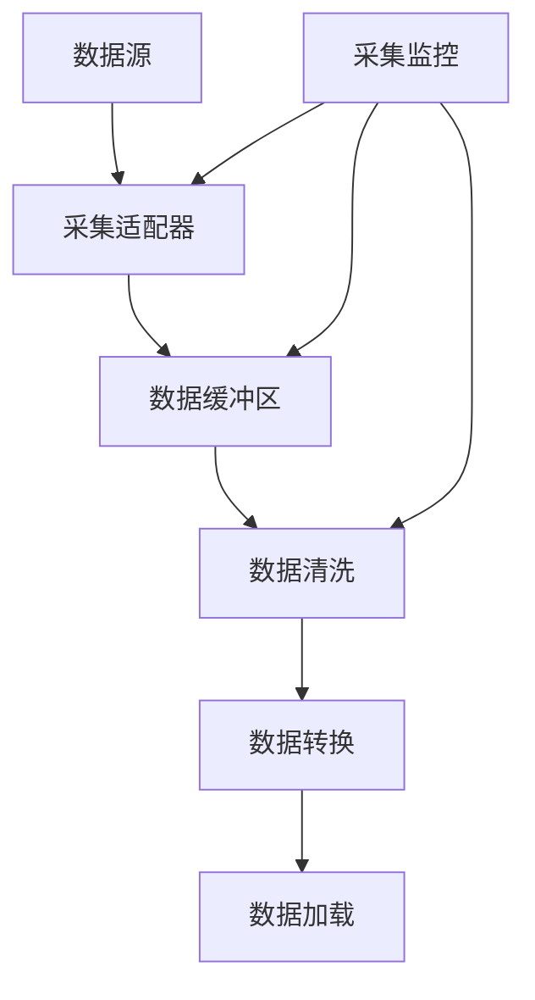

# 数据中台补充设计文档

## 1. 数据采集与接入架构

### 1.1 数据采集框架

### 1.2 数据接入方式
1. 实时接入
   - API实时调用
   - 消息队列订阅
   - 数据库触发
   - 文件监听

2. 准实时接入
   - 定时采集
   - 增量同步
   - 批量导入
   - 文件传输

3. 离线接入
   - 批处理导入
   - 历史数据迁移
   - 文件导入
   - 手工录入

## 2. 数据标准化管理

### 2.1 数据标准体系
1. 基础标准
   - 命名规范
   - 代码规范
   - 格式规范
   - 值域规范

2. 技术标准
   - 接口标准
   - 存储标准
   - 交换标准
   - 安全标准

3. 管理标准
   - 流程标准
   - 质量标准
   - 服务标准
   - 审计标准

### 2.2 标准化流程
1. 标准制定
   - 需求分析
   - 标准设计
   - 标准评审
   - 标准发布

2. 标准实施
   - 标准宣贯
   - 标准执行
   - 标准监控
   - 标准优化

## 3. 数据质量控制

### 3.1 质量控制维度
1. 完整性
   - 字段完整性
   - 记录完整性
   - 数据集完整性
   - 关系完整性

2. 准确性
   - 值域准确性
   - 格式准确性
   - 逻辑准确性
   - 一致性准确性

3. 及时性
   - 数据更新及时性
   - 数据处理及时性
   - 数据同步及时性
   - 数据服务及时性

### 3.2 质量控制流程
1. 质量检查
   - 规则配置
   - 自动检查
   - 问题发现
   - 问题记录

2. 质量处理
   - 问题确认
   - 原因分析
   - 处理方案
   - 处理执行

3. 质量评估
   - 指标计算
   - 趋势分析
   - 问题统计
   - 改进建议

## 4. 数据服务能力

### 4.1 服务类型
1. 基础数据服务
   - 数据查询服务
   - 数据统计服务
   - 数据分析服务
   - 数据导出服务

2. 高级数据服务
   - 数据挖掘服务
   - 数据建模服务
   - 数据预测服务
   - 数据可视化服务

### 4.2 服务管理
1. 服务注册
   - 服务定义
   - 接口规范
   - 服务文档
   - 服务测试

2. 服务监控
   - 性能监控
   - 质量监控
   - 使用监控
   - 异常监控

## 5. 性能优化方案

### 5.1 存储优化
1. 分层存储
   - 热数据层
   - 温数据层
   - 冷数据层
   - 归档层

2. 存储策略
   - 数据压缩
   - 分区存储
   - 索引优化
   - 缓存使用

### 5.2 计算优化
1. 并行计算
   - 任务分解
   - 并行处理
   - 结果合并
   - 资源调度

2. 查询优化
   - SQL优化
   - 执行计划优化
   - 缓存优化
   - 结果集优化

## 6. 监控预警体系

### 6.1 监控指标
1. 系统指标
   - CPU使用率
   - 内存使用率
   - 磁盘使用率
   - 网络使用率

2. 业务指标
   - 数据量监控
   - 处理速度监控
   - 服务响应监控
   - 错误率监控

### 6.2 预警管理
1. 预警规则
   - 阈值设置
   - 规则配置
   - 触发条件
   - 预警级别

2. 预警处理
   - 预警发送
   - 问题处理
   - 结果反馈
   - 预警关闭