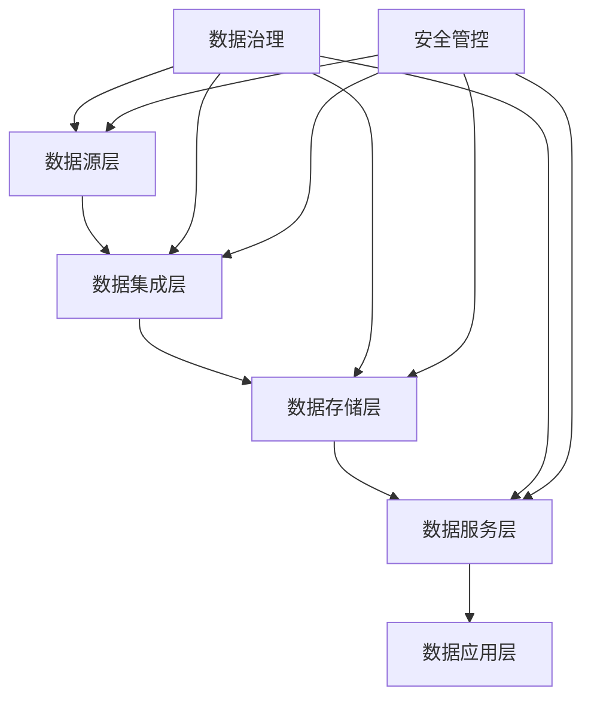

# 数据中台详细设计方案

## 1. 总体架构设计

### 1.1 逻辑架构


### 1.2 功能架构
1. 数据源层
   - 内部系统数据接入
   - 外部系统数据对接
   - 文件数据导入 
   - 实时数据采集

2. 数据集成层
   - ETL处理
   - 数据清洗
   - 数据转换
   - 数据加载

3. 数据存储层
   - 关系型存储
   - 文档型存储
   - 分析型存储
   - 缓存存储

4. 数据服务层
   - API服务
   - 数据服务
   - 分析服务
   - 订阅服务

5. 数据应用层
   - 数据可视化
   - 统计分析
   - 风险预警
   - 辅助决策

### 1.3 技术架构
1. 开发框架
   - SpringCloud微服务架构
   - MyBatis持久层框架
   - Redis缓存框架
   - ElasticSearch搜索引擎

2. 数据库选型
   - MySQL：关系型数据存储
   - MongoDB：文档型数据存储
   - ClickHouse：分析型数据存储
   - Redis：缓存数据存储

3. 中间件选型
   - RabbitMQ：消息队列
   - Kafka：日志收集
   - Zookeeper：服务注册
   - Nacos：配置中心

## 2. 数据库设计

### 2.1 元数据库设计
```sql
-- 数据源定义
CREATE TABLE meta_datasource (
    source_id VARCHAR(32) PRIMARY KEY,
    source_name VARCHAR(100),
    source_type VARCHAR(50),
    connection_info TEXT,
    create_time DATETIME,
    update_time DATETIME,
    status VARCHAR(20)
);

-- 数据模型定义
CREATE TABLE meta_datamodel (
    model_id VARCHAR(32) PRIMARY KEY,
    model_name VARCHAR(100),
    model_type VARCHAR(50),
    schema_info TEXT,
    create_time DATETIME,
    update_time DATETIME,
    status VARCHAR(20)
);

-- 数据服务定义
CREATE TABLE meta_dataservice (
    service_id VARCHAR(32) PRIMARY KEY,
    service_name VARCHAR(100),
    service_type VARCHAR(50),
    api_schema TEXT,
    create_time DATETIME,
    update_time DATETIME,
    status VARCHAR(20)
);
```

### 2.2 主数据库设计
```sql
-- 企业主数据
CREATE TABLE master_enterprise (
    enterprise_id VARCHAR(32) PRIMARY KEY,
    credit_code VARCHAR(50),
    enterprise_name VARCHAR(200),
    legal_person VARCHAR(50),
    contact_info TEXT,
    address TEXT,
    create_time DATETIME,
    update_time DATETIME,
    status VARCHAR(20)
);

-- 产品主数据
CREATE TABLE master_product (
    product_id VARCHAR(32) PRIMARY KEY,
    product_name VARCHAR(200),
    product_type VARCHAR(50),
    specification TEXT,
    manufacturer VARCHAR(200),
    create_time DATETIME,
    update_time DATETIME,
    status VARCHAR(20)
);
```

### 2.3 业务数据库设计
```sql
-- 许可数据
CREATE TABLE business_license (
    license_id VARCHAR(32) PRIMARY KEY,
    enterprise_id VARCHAR(32),
    license_type VARCHAR(50),
    valid_date DATE,
    scope TEXT,
    create_time DATETIME,
    update_time DATETIME,
    status VARCHAR(20)
);

-- 监管数据
CREATE TABLE business_supervision (
    supervision_id VARCHAR(32) PRIMARY KEY,
    enterprise_id VARCHAR(32),
    check_type VARCHAR(50),
    check_date DATE,
    result TEXT,
    create_time DATETIME,
    update_time DATETIME,
    status VARCHAR(20)
);
```

## 3. 接口设计

### 3.1 数据集成接口
```
// 数据源注册
POST /api/v1/integration/source/register
Request: {
    source_name: string,      // 数据源名称
    source_type: string,      // 数据源类型
    connection_info: object,  // 连接信息
    schema_info: object      // 数据结构
}

// 数据接入配置
POST /api/v1/integration/config
Request: {
    source_id: string,       // 数据源ID
    collect_type: string,    // 采集类型
    collect_rule: object,    // 采集规则
    transform_rule: object   // 转换规则
}
```

### 3.2 数据服务接口
```
// 数据服务注册
POST /api/v1/service/register
Request: {
    service_name: string,    // 服务名称
    service_type: string,    // 服务类型
    api_schema: object,     // 接口定义
    auth_info: object      // 权限信息
}

// 数据服务调用
POST /api/v1/service/invoke
Request: {
    service_id: string,    // 服务ID
    params: object,       // 调用参数
    context: object      // 上下文信息
}
```

### 3.3 数据治理接口
```
// 数据质量检查
POST /api/v1/govern/quality/check
Request: {
    data_id: string,     // 数据ID
    check_rules: array,  // 检查规则
    check_level: string  // 检查级别
}

// 数据标准执行
POST /api/v1/govern/standard/execute
Request: {
    data_id: string,     // 数据ID
    standard_id: string, // 标准ID
    exec_params: object  // 执行参数
}
```

## 4. 安全设计

### 4.1 访问控制
1. 身份认证
   - 统一身份认证
   - 多因素认证
   - 令牌管理
   - 会话控制

2. 权限管理
   - 角色权限控制
   - 数据权限控制
   - 功能权限控制
   - 接口权限控制

### 4.2 数据安全
1. 传输安全
   - HTTPS加密传输
   - 数据加密传输
   - 证书管理
   - 密钥管理

2. 存储安全
   - 数据加密存储
   - 敏感信息脱敏
   - 数据备份策略
   - 数据恢复机制

### 4.3 审计日志
1. 操作审计
   - 用户操作记录
   - 重要操作确认
   - 异常操作告警
   - 操作追溯分析

2. 安全审计
   - 访问日志记录
   - 安全事件记录
   - 审计日志分析
   - 审计报告生成

## 5. 部署方案

### 5.1 环境部署
1. 开发环境
   - 开发服务器配置
   - 开发数据库配置
   - 开发工具配置
   - 测试环境配置

2. 生产环境
   - 应用服务器集群
   - 数据库服务器集群
   - 中间件服务器集群
   - 负载均衡配置

### 5.2 高可用方案
1. 服务高可用
   - 服务集群部署
   - 服务自动切换
   - 服务健康检查
   - 服务监控告警

2. 数据高可用
   - 数据库主从复制
   - 数据实时同步
   - 数据定期备份
   - 数据容灾恢复

## 6. 性能优化

### 6.1 系统性能
1. 并发处理
   - 线程池优化
   - 连接池优化
   - 缓存策略优化
   - 队列处理优化

2. 响应时间
   - SQL优化
   - 接口优化
   - 缓存优化
   - 代码优化

### 6.2 数据性能
1. 存储优化
   - 分表分库策略
   - 索引优化策略
   - 存储压缩策略
   - 数据归档策略

2. 查询优化
   - 查询条件优化
   - 聚合计算优化
   - 分页查询优化
   - 缓存查询优化