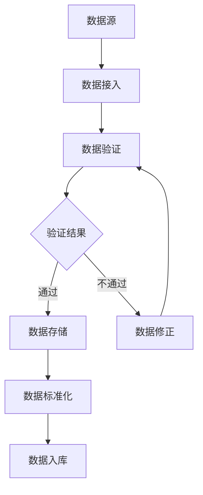
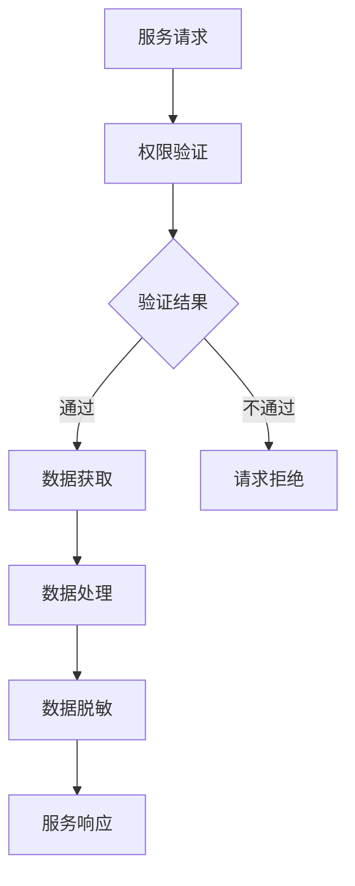
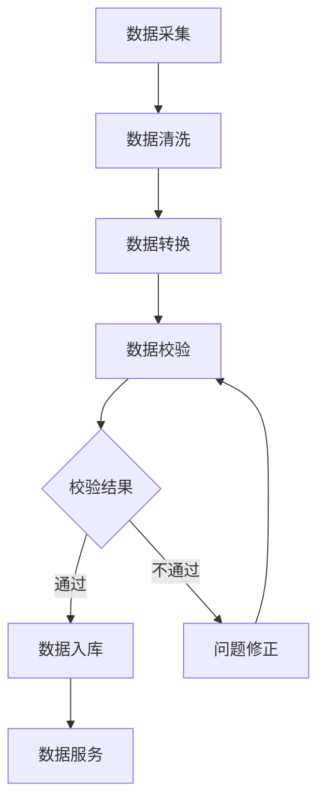
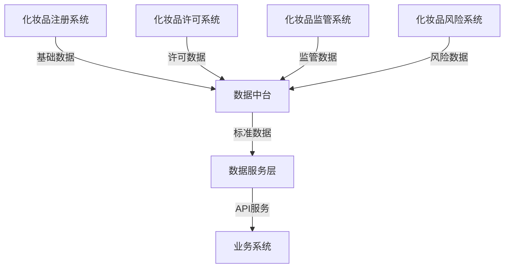
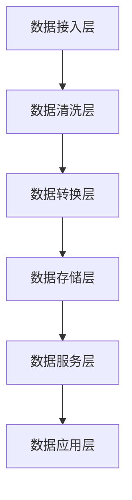

# 数据共享服务模块业务流程与数据流转设计

## 1. 业务流程图

### 1.1 数据采集流程


### 1.2 数据服务流程


### 1.3 数据治理流程


## 2. 数据流转图

### 2.1 系统间数据流转


### 2.2 数据处理流转


## 3. 关键业务规则

### 3.1 数据采集规则
1. 数据来源必须是合法授权的系统或接口
2. 数据必须符合预定义的格式和标准
3. 数据必须包含必要的元数据信息
4. 数据采集必须保证实时性和完整性

### 3.2 数据处理规则
1. 数据清洗必须遵循标准化处理规则
2. 数据转换必须保证数据一致性
3. 数据校验必须覆盖所有关键字段
4. 异常数据必须有明确的处理流程

### 3.3 数据服务规则
1. 服务接口必须进行版本管理
2. 服务调用必须进行身份认证
3. 敏感数据必须进行脱敏处理
4. 服务响应必须符合SLA要求

### 3.4 数据安全规则
1. 数据访问必须基于最小权限原则
2. 敏感数据必须进行加密存储
3. 数据操作必须保留完整日志
4. 数据备份必须定期执行

## 4. 补充数据模型

### 4.1 元数据模型
```
MetaData {
    meta_id: string         // 元数据ID
    data_source: string     // 数据源
    data_type: string      // 数据类型
    data_format: string    // 数据格式
    update_frequency: string // 更新频率
    data_quality: object   // 质量指标
}
```

### 4.2 数据血缘模型
```
DataLineage {
    lineage_id: string     // 血缘ID
    source_id: string     // 源数据ID
    target_id: string    // 目标数据ID
    transform_rule: string // 转换规则
    update_time: date    // 更新时间
}
```

### 4.3 服务调用模型
```
ServiceInvocation {
    invoke_id: string     // 调用ID
    service_id: string   // 服务ID
    caller: string      // 调用方
    invoke_time: date   // 调用时间
    response_time: number // 响应时间
    result: string      // 调用结果
}
```

## 5. 补充接口定义

### 5.1 数据接入接口
```
// 数据接入注册
POST /api/v1/data/register
Request: {
    source_info: object,   // 数据源信息
    schema: object        // 数据结构
}

// 数据推送接口
POST /api/v1/data/push
Request: {
    source_id: string,    // 数据源ID
    data: array          // 数据内容
}
```

### 5.2 数据服务接口
```
// 数据服务注册
POST /api/v1/service/register
Request: {
    service_info: object,  // 服务信息
    api_schema: object    // 接口定义
}

// 服务调用统计
GET /api/v1/service/stats
Response: {
    service_stats: array  // 调用统计
}
```

### 5.3 数据治理接口
```
// 数据质量检查
POST /api/v1/govern/check
Request: {
    data_id: string,     // 数据ID
    rules: array        // 检查规则
}

// 数据处理任务
POST /api/v1/govern/task
Request: {
    task_type: string,   // 任务类型
    config: object      // 任务配置
}
```