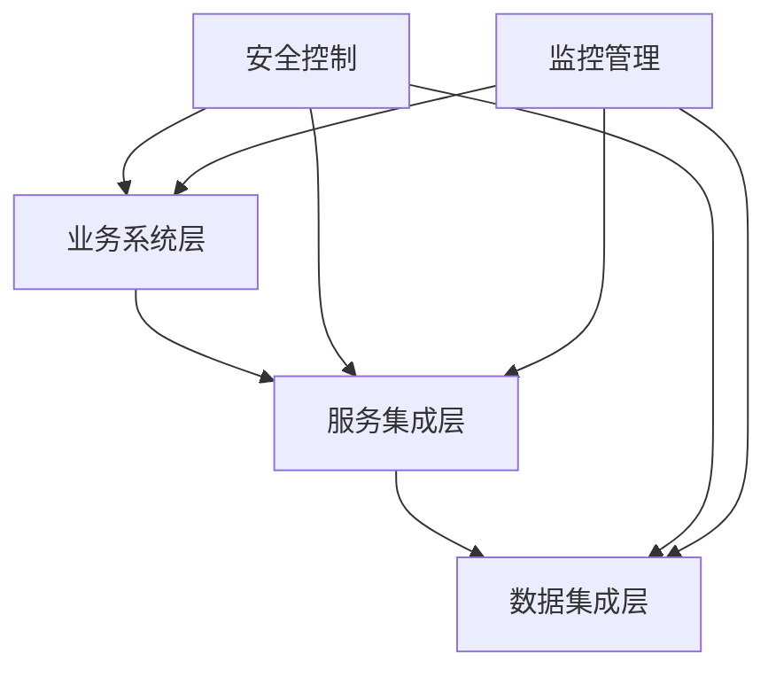

# 系统集成详细设计方案

## 1. 总体集成架构

### 1.1 集成框架


### 1.2 集成模式
1. 应用集成
   - 服务调用
   - 消息传递
   - 文件传输
   - 数据共享

2. 数据集成
   - 数据抽取
   - 数据转换
   - 数据加载
   - 数据同步

## 2. 系统间接口设计

### 2.1 接口规范
1. REST接口规范
   - URI命名规范
   - 请求方法规范
   - 状态码规范
   - 返回格式规范

2. 消息格式规范
   - 消息头定义
   - 消息体格式
   - 错误码规范
   - 验证规则

### 2.2 接口定义
```
// 数据接入接口
POST /api/v1/integration/data/import
Request: {
    source_system: string,   // 来源系统
    data_type: string,      // 数据类型
    data: array            // 数据内容
}

// 数据同步接口
POST /api/v1/integration/data/sync
Request: {
    target_system: string,  // 目标系统
    sync_type: string,     // 同步类型
    data: array           // 同步数据
}

// 服务调用接口
POST /api/v1/integration/service/invoke
Request: {
    service_name: string,  // 服务名称
    method: string,       // 方法名称
    params: object       // 调用参数
}
```

## 3. 数据流转设计

### 3.1 数据流转规则
1. 实时流转规则
   - 触发条件
   - 流转路径
   - 处理规则
   - 异常处理

2. 批量流转规则
   - 调度策略
   - 数据范围
   - 处理流程
   - 失败重试

### 3.2 数据映射规则
1. 字段映射
   - 字段对应关系
   - 数据类型转换
   - 默认值处理
   - 特殊值处理

2. 业务映射
   - 编码转换
   - 状态转换
   - 关系映射
   - 规则转换

## 4. 集成安全设计

### 4.1 认证授权
1. 系统认证
   - 系统身份认证
   - 接口调用认证
   - 令牌管理
   - 证书管理

2. 访问控制
   - 权限验证
   - 访问限制
   - 操作审计
   - 异常处理

### 4.2 数据安全
1. 传输安全
   - 数据加密
   - 完整性校验
   - 防重放攻击
   - 时间戳验证

2. 存储安全
   - 敏感数据加密
   - 数据脱敏
   - 访问控制
   - 审计日志

## 5. 集成监控设计

### 5.1 监控指标
1. 服务监控
   - 服务可用性
   - 响应时间
   - 调用次数
   - 错误率

2. 数据监控
   - 数据量监控
   - 同步状态
   - 处理延迟
   - 质量问题

### 5.2 告警管理
1. 告警规则
   - 阈值设置
   - 规则配置
   - 级别定义
   - 通知方式

2. 处理流程
   - 问题发现
   - 告警通知
   - 处理跟踪
   - 结果反馈

## 6. 部署配置说明

### 6.1 环境配置
1. 开发环境
   - 服务器配置
   - 网络配置
   - 中间件配置
   - 数据库配置

2. 生产环境
   - 负载均衡配置
   - 集群配置
   - 容灾配置
   - 备份配置

### 6.2 参数配置
1. 系统参数
   - 连接参数
   - 超时参数
   - 并发参数
   - 缓存参数

2. 业务参数
   - 流程参数
   - 规则参数
   - 阈值参数
   - 调度参数

## 7. 运维管理方案

### 7.1 日常运维
1. 系统运维
   - 性能监控
   - 资源管理
   - 日志管理
   - 备份管理

2. 应用运维
   - 服务管理
   - 配置管理
   - 版本管理
   - 问题处理

### 7.2 应急处置
1. 故障处理
   - 故障发现
   - 影响评估
   - 处理方案
   - 结果验证

2. 容灾恢复
   - 灾备切换
   - 数据恢复
   - 服务恢复
   - 运行验证