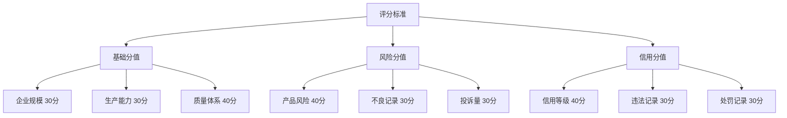
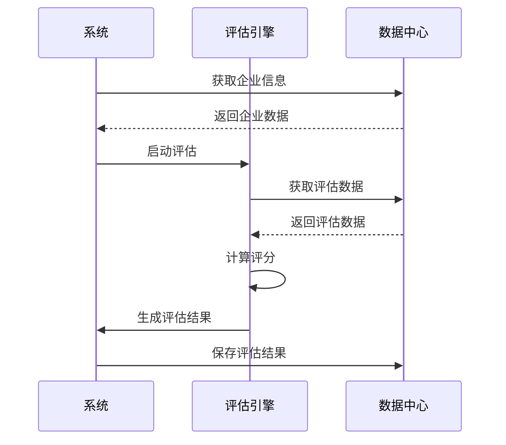
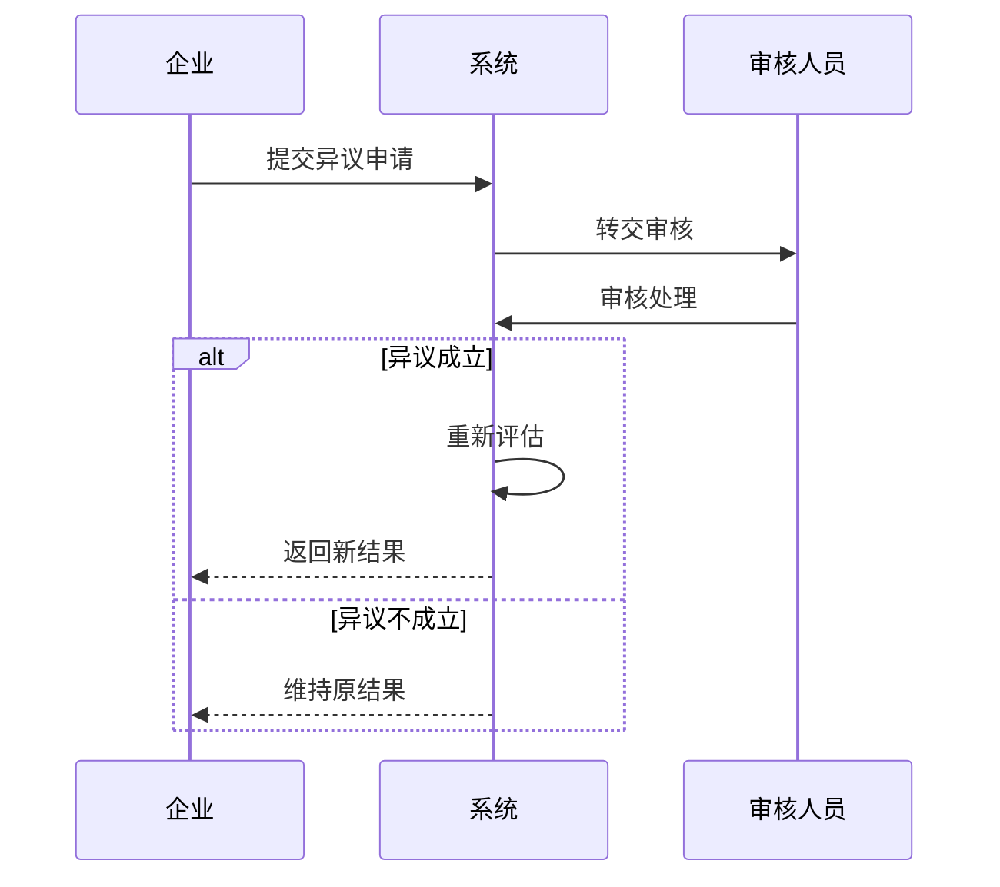

# 化妆品分级分类系统详细设计文档

## 1. 系统概述

### 1.1 系统目标
针对化妆品企业主体进行分级分类管理，实现自动化评级，提升监管效率，合理分配监管资源。

### 1.2 系统范围
- 企业基础设置
- 分级分类要素设定
- 分级分类等级设定
- 分级分类登记
- 年度分级分类汇总
- 分级分类查询统计

## 2. 功能设计

### 2.1 企业基础设置
1. 企业类别管理
- 生产企业
- 经营企业
- 电商平台

2. 企业业态管理
- 生产业态
- 经营业态
- 网络销售

3. 生产经营品种管理
- 普通化妆品
- 特殊化妆品
- 进口化妆品

### 2.2 分级分类要素设定

#### 2.2.1 评估要素
1. 基础要素
- 企业规模
- 生产能力
- 质量管理体系

2. 风险要素
- 产品风险等级
- 不良记录
- 投诉举报情况

3. 信用要素
- 信用等级
- 违法违规记录
- 行政处罚记录

#### 2.2.2 评分标准


### 2.3 分级分类等级设定

#### 2.3.1 企业分级标准
1. A级企业(90-100分)
- 守信企业
- 风险低
- 管理规范

2. B级企业(75-89分)
- 基本守信
- 风险可控
- 管理基本规范

3. C级企业(60-74分)
- 失信企业
- 风险较高
- 管理不规范

4. D级企业(60分以下)
- 严重失信
- 高风险
- 管理混乱

#### 2.3.2 监管措施
1. A级企业
- 自主申报
- 简化检查
- 优先办理

2. B级企业
- 常规监管
- 定期检查
- 正常办理

3. C级企业
- 重点监管
- 加密检查
- 严格审核

4. D级企业
- 严格监管
- 重点检查
- 限制准入

## 3. 数据模型设计

### 3.1 数据库表设计

```sql
-- 企业基础信息表
CREATE TABLE cos_enterprise_base (
    id BIGINT PRIMARY KEY AUTO_INCREMENT COMMENT '主键ID',
    enterprise_name VARCHAR(200) NOT NULL COMMENT '企业名称',
    credit_code VARCHAR(18) NOT NULL COMMENT '统一社会信用代码',
    enterprise_type TINYINT COMMENT '企业类型:1生产,2经营,3电商',
    business_mode TINYINT COMMENT '业态:1生产,2经营,3网络',
    product_type VARCHAR(500) COMMENT '经营品种',
    create_time DATETIME DEFAULT CURRENT_TIMESTAMP,
    update_time DATETIME DEFAULT CURRENT_TIMESTAMP ON UPDATE CURRENT_TIMESTAMP,
    UNIQUE KEY uk_credit_code(credit_code)
) COMMENT='企业基础信息表';

-- 分级分类评估表
CREATE TABLE cos_enterprise_grade (
    id BIGINT PRIMARY KEY AUTO_INCREMENT COMMENT '主键ID',
    enterprise_id BIGINT NOT NULL COMMENT '企业ID',
    base_score DECIMAL(5,2) COMMENT '基础分值',
    risk_score DECIMAL(5,2) COMMENT '风险分值',
    credit_score DECIMAL(5,2) COMMENT '信用分值',
    total_score DECIMAL(5,2) COMMENT '总分',
    grade_level CHAR(1) COMMENT '等级:A,B,C,D',
    evaluate_year INT COMMENT '评估年度',
    evaluate_status TINYINT COMMENT '状态:0待评,1已评,2异议',
    create_time DATETIME DEFAULT CURRENT_TIMESTAMP,
    update_time DATETIME DEFAULT CURRENT_TIMESTAMP ON UPDATE CURRENT_TIMESTAMP,
    KEY idx_enterprise_id(enterprise_id)
) COMMENT='企业分级分类评估表';
```

## 4. 接口设计

### 4.1 评估接口

```yaml
接口名称: /api/v1/enterprise/evaluate
请求方式: POST
接口说明: 企业分级评估接口

请求参数:
  - name: enterpriseId
    type: long
    required: true
    desc: 企业ID
  - name: evaluateYear
    type: integer
    required: true
    desc: 评估年度

返回参数:
  - name: code
    type: integer
    desc: 状态码
  - name: message
    type: string
    desc: 返回信息
  - name: data
    type: object
    desc: 评估结果
```

### 4.2 查询接口

```yaml
接口名称: /api/v1/enterprise/grade/query
请求方式: GET
接口说明: 企业分级查询接口

请求参数:
  - name: enterpriseId
    type: long
    required: false
    desc: 企业ID
  - name: gradeLevel
    type: string
    required: false
    desc: 等级
  - name: evaluateYear
    type: integer
    required: false
    desc: 评估年度

返回参数:
  - name: code
    type: integer
    desc: 状态码
  - name: message
    type: string
    desc: 返回信息
  - name: data
    type: array
    desc: 查询结果列表
```

## 5. 系统流程

### 5.1 评估流程


### 5.2 异议处理流程


## 6. 系统部署

### 6.1 部署架构
1. 应用服务器
- CPU: 8核
- 内存: 16G
- 磁盘: 200G

2. 数据库服务器
- CPU: 16核
- 内存: 32G
- 磁盘: 500G

### 6.2 性能要求
1. 并发要求
- 支持100用户同时在线
- 单次评估响应时间<3秒
- 批量评估速度>1000条/分钟

2. 数据要求
- 数据实时同步
- 评估结果实时更新
- 历史数据保留3年