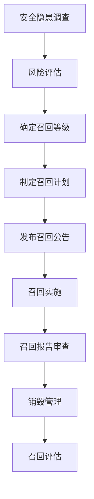
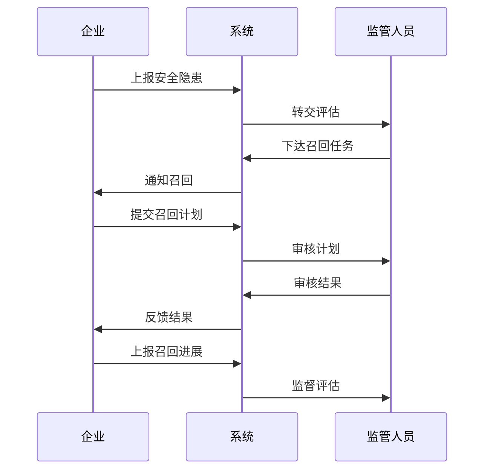
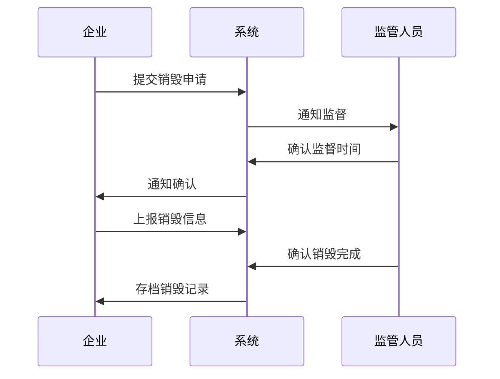

# 化妆品召回销毁系统设计文档

## 1. 系统概述

### 1.1 系统目标
建立化妆品召回销毁管理系统，实现化妆品召回全流程管理和销毁过程监督，保障化妆品质量安全。

### 1.2 系统范围
- 召回销毁管理
- 企业召回管理
- 企业销毁管理
- 监管追踪管理

## 2. 功能设计

### 2.1 召回销毁管理

#### 2.1.1 主要功能
1. 安全隐患调查评估
2. 召回等级设置
3. 召回计划管理
4. 召回公告发布
5. 召回报告审查
6. 销毁情况管理
7. 召回总结评估
8. 召回效果评价

#### 2.1.2 业务流程


### 2.2 企业召回管理

#### 2.2.1 主要功能
1. 安全隐患上报
2. 调查评估报告
3. 召回任务接收
4. 召回计划制定
5. 召回进展上报
6. 处理记录管理
7. 整改报告上报

#### 2.2.2 召回流程


### 2.3 企业销毁管理 

#### 2.3.1 主要功能
1. 销毁信息登记
2. 销毁信息修改
3. 销毁信息查询
4. 销毁信息删除
5. 销毁现场监督
6. 销毁记录存档

#### 2.3.2 销毁流程


## 3. 数据模型设计

### 3.1 数据库表设计

```sql
-- 召回信息表
CREATE TABLE cos_recall_info (
    id BIGINT PRIMARY KEY AUTO_INCREMENT COMMENT '主键ID',
    recall_no VARCHAR(50) NOT NULL COMMENT '召回编号',
    enterprise_id BIGINT NOT NULL COMMENT '企业ID',
    product_name VARCHAR(200) NOT NULL COMMENT '产品名称',
    batch_no VARCHAR(50) NOT NULL COMMENT '批次号',
    recall_level TINYINT COMMENT '召回等级:1,2,3',
    recall_reason VARCHAR(500) COMMENT '召回原因',
    recall_status TINYINT COMMENT '状态:0新建,1进行,2完成',
    create_time DATETIME DEFAULT CURRENT_TIMESTAMP,
    update_time DATETIME DEFAULT CURRENT_TIMESTAMP ON UPDATE CURRENT_TIMESTAMP,
    UNIQUE KEY uk_recall_no(recall_no)
) COMMENT='召回信息表';

-- 销毁信息表
CREATE TABLE cos_destroy_info (
    id BIGINT PRIMARY KEY AUTO_INCREMENT COMMENT '主键ID',
    destroy_no VARCHAR(50) NOT NULL COMMENT '销毁编号',
    recall_id BIGINT NOT NULL COMMENT '召回ID',
    destroy_time DATETIME COMMENT '销毁时间',
    destroy_place VARCHAR(200) COMMENT '销毁地点',
    destroy_method VARCHAR(50) COMMENT '销毁方式',
    destroy_quantity INT COMMENT '销毁数量',
    supervisor_id BIGINT COMMENT '监督人员ID',
    destroy_status TINYINT COMMENT '状态:0待销毁,1已销毁',
    create_time DATETIME DEFAULT CURRENT_TIMESTAMP,
    update_time DATETIME DEFAULT CURRENT_TIMESTAMP ON UPDATE CURRENT_TIMESTAMP,
    UNIQUE KEY uk_destroy_no(destroy_no),
    KEY idx_recall_id(recall_id)
) COMMENT='销毁信息表';
```

## 4. 接口设计

### 4.1 召回接口

```yaml
接口名称: /api/v1/recall/submit
请求方式: POST
接口说明: 召回信息提交接口

请求参数:
  - name: enterpriseId
    type: long
    required: true
    desc: 企业ID
  - name: productName
    type: string
    required: true
    desc: 产品名称
  - name: batchNo
    type: string
    required: true
    desc: 批次号
  - name: recallReason
    type: string
    required: true
    desc: 召回原因

返回参数:
  - name: code
    type: integer
    desc: 状态码
  - name: message
    type: string
    desc: 返回信息
  - name: data
    type: object
    desc: 召回信息
```

### 4.2 销毁接口

```yaml
接口名称: /api/v1/destroy/submit
请求方式: POST
接口说明: 销毁信息提交接口

请求参数:
  - name: recallId
    type: long
    required: true
    desc: 召回ID
  - name: destroyTime
    type: datetime
    required: true
    desc: 销毁时间
  - name: destroyPlace
    type: string
    required: true
    desc: 销毁地点
  - name: destroyMethod
    type: string
    required: true
    desc: 销毁方式
  - name: destroyQuantity
    type: integer
    required: true
    desc: 销毁数量

返回参数:
  - name: code
    type: integer
    desc: 状态码
  - name: message
    type: string
    desc: 返回信息
  - name: data
    type: object
    desc: 销毁信息
```

## 5. 系统部署

### 5.1 部署要求
1. 服务器配置
- Web服务器: 8核16G
- 数据库服务器: 16核32G
- 文件服务器: 500G存储

2. 软件环境
- 操作系统: CentOS 7.x
- 数据库: MySQL 8.0
- 应用服务器: Tomcat 9.0
- JDK版本: 1.8+

### 5.2 性能要求
1. 响应时间
- 页面加载<3秒
- 数据处理<5秒
- 文件上传<10秒

2. 并发要求
- 支持100用户同时在线
- 支持1000次/分钟的接口调用
- 支持100MB/s的文件上传