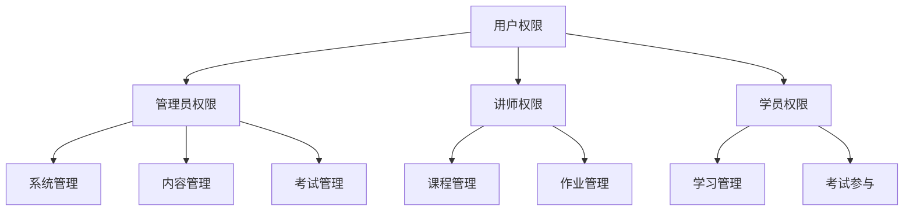
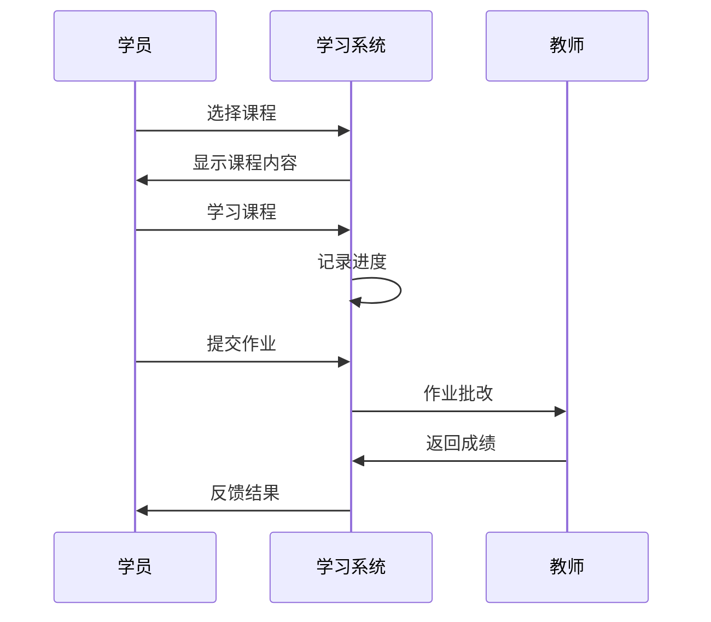
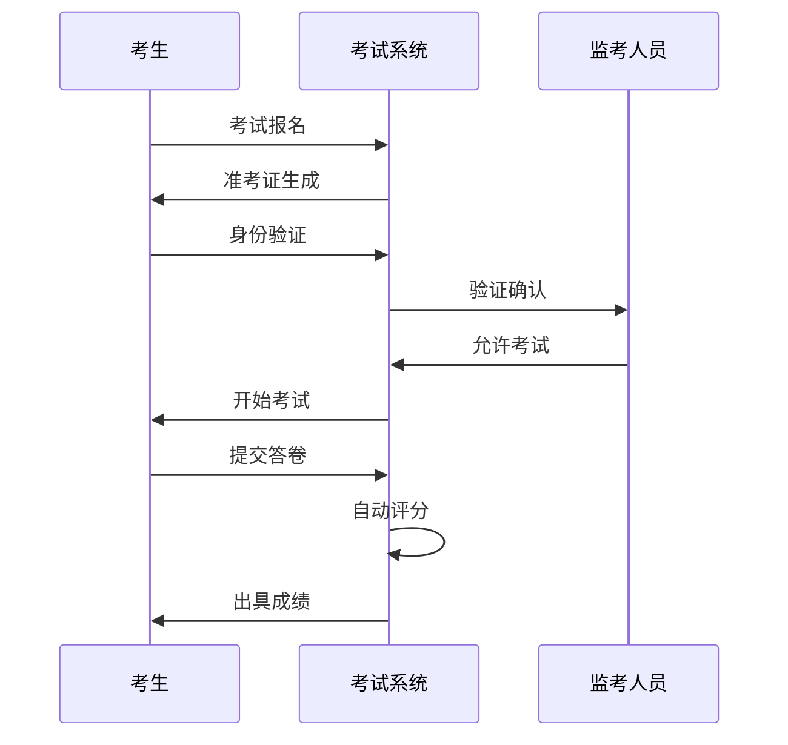

# 化妆品培训考试系统设计文档

## 1. 系统概述

### 1.1 系统目标
构建化妆品行业从业人员培训考试系统，实现培训资源管理、在线学习、考试管理等功能，提升从业人员专业素养。

### 1.2 系统范围
- 用户管理
- 培训内容管理
- 培训学习管理
- 考试管理
- 证书管理

## 2. 功能设计

### 2.1 用户管理模块

#### 2.1.1 用户类型
1. 管理员
- 系统管理员
- 培训管理员
- 考试管理员

2. 讲师用户
- 内部讲师
- 外部讲师

3. 学员用户
- 企业从业人员
- 个人学习者

#### 2.1.2 权限管理


### 2.2 培训内容管理

#### 2.2.1 课程管理
1. 课程分类
- 法规知识
- 质量管理
- 生产技术
- 安全管理

2. 课程形式
- 在线视频
- 文档资料
- 直播课程
- 线下培训

3. 内容审核
- 内容上传
- 内容审核
- 内容发布
- 内容维护

### 2.3 培训学习管理

#### 2.3.1 学习功能
1. 课程学习
- 视频播放
- 资料下载
- 笔记记录
- 问答互动

2. 学习跟踪
- 学习进度
- 学习时长
- 作业完成
- 测验成绩

#### 2.3.2 学习流程


### 2.4 考试管理

#### 2.4.1 考试功能
1. 题库管理
- 题目录入
- 题目分类
- 题目审核
- 题目维护

2. 试卷管理
- 试卷编制
- 试卷审核
- 试卷发布
- 成绩管理

3. 考试监控
- 身份验证
- 作弊防控
- 异常记录
- 结果统计

#### 2.4.2 考试流程


## 3. 数据模型设计

### 3.1 数据库表设计

```sql
-- 用户信息表
CREATE TABLE cos_user_info (
    id BIGINT PRIMARY KEY AUTO_INCREMENT COMMENT '主键ID',
    username VARCHAR(50) NOT NULL COMMENT '用户名',
    password VARCHAR(100) NOT NULL COMMENT '密码',
    real_name VARCHAR(50) COMMENT '真实姓名',
    id_card VARCHAR(18) COMMENT '身份证号',
    phone VARCHAR(20) COMMENT '联系电话',
    user_type TINYINT COMMENT '用户类型:1管理员,2讲师,3学员',
    status TINYINT DEFAULT 1 COMMENT '状态:0禁用,1启用',
    create_time DATETIME DEFAULT CURRENT_TIMESTAMP,
    update_time DATETIME DEFAULT CURRENT_TIMESTAMP ON UPDATE CURRENT_TIMESTAMP,
    UNIQUE KEY uk_username(username)
) COMMENT='用户信息表';

-- 课程信息表
CREATE TABLE cos_course_info (
    id BIGINT PRIMARY KEY AUTO_INCREMENT COMMENT '主键ID',
    course_name VARCHAR(200) NOT NULL COMMENT '课程名称',
    course_type TINYINT COMMENT '课程类型:1视频,2文档,3直播',
    category_id BIGINT COMMENT '分类ID',
    teacher_id BIGINT COMMENT '讲师ID',
    course_status TINYINT COMMENT '状态:0下架,1上架',
    create_time DATETIME DEFAULT CURRENT_TIMESTAMP,
    update_time DATETIME DEFAULT CURRENT_TIMESTAMP ON UPDATE CURRENT_TIMESTAMP,
    KEY idx_category_id(category_id),
    KEY idx_teacher_id(teacher_id)
) COMMENT='课程信息表';

-- 考试信息表
CREATE TABLE cos_exam_info (
    id BIGINT PRIMARY KEY AUTO_INCREMENT COMMENT '主键ID',
    exam_name VARCHAR(200) NOT NULL COMMENT '考试名称',
    exam_type TINYINT COMMENT '考试类型:1在线,2线下',
    start_time DATETIME COMMENT '开始时间',
    end_time DATETIME COMMENT '结束时间',
    total_score INT COMMENT '总分',
    pass_score INT COMMENT '及格分',
    exam_status TINYINT COMMENT '状态:0未开始,1进行中,2已结束',
    create_time DATETIME DEFAULT CURRENT_TIMESTAMP,
    update_time DATETIME DEFAULT CURRENT_TIMESTAMP ON UPDATE CURRENT_TIMESTAMP
) COMMENT='考试信息表';
```

## 4. 接口设计

### 4.1 用户接口

```yaml
接口名称: /api/v1/user/login
请求方式: POST
接口说明: 用户登录接口

请求参数:
  - name: username
    type: string
    required: true
    desc: 用户名
  - name: password
    type: string
    required: true
    desc: 密码

返回参数:
  - name: code
    type: integer
    desc: 状态码
  - name: message
    type: string
    desc: 返回信息
  - name: data
    type: object
    desc: 用户信息
```

### 4.2 课程接口

```yaml
接口名称: /api/v1/course/list
请求方式: GET
接口说明: 课程列表查询接口

请求参数:
  - name: categoryId
    type: long
    required: false
    desc: 分类ID
  - name: courseType
    type: integer
    required: false
    desc: 课程类型
  - name: pageNum
    type: integer
    required: true
    desc: 页码
  - name: pageSize
    type: integer
    required: true
    desc: 页大小

返回参数:
  - name: code
    type: integer
    desc: 状态码
  - name: message
    type: string
    desc: 返回信息
  - name: data
    type: object
    desc: 课程列表
```

## 5. 系统部署

### 5.1 部署要求
1. 服务器配置
- Web服务器: 8核16G
- 数据库服务器: 16核32G
- 文件服务器: 1TB存储

2. 软件环境
- 操作系统: CentOS 7.x
- 数据库: MySQL 8.0
- 应用服务器: Tomcat 9.0
- JDK版本: 1.8+

### 5.2 性能要求
1. 响应时间
- 页面加载<2秒
- 视频加载<5秒
- 考试提交<3秒

2. 并发要求
- 支持1000用户同时在线学习
- 支持500用户同时在线考试
- 支持100MB/s的视频流播放