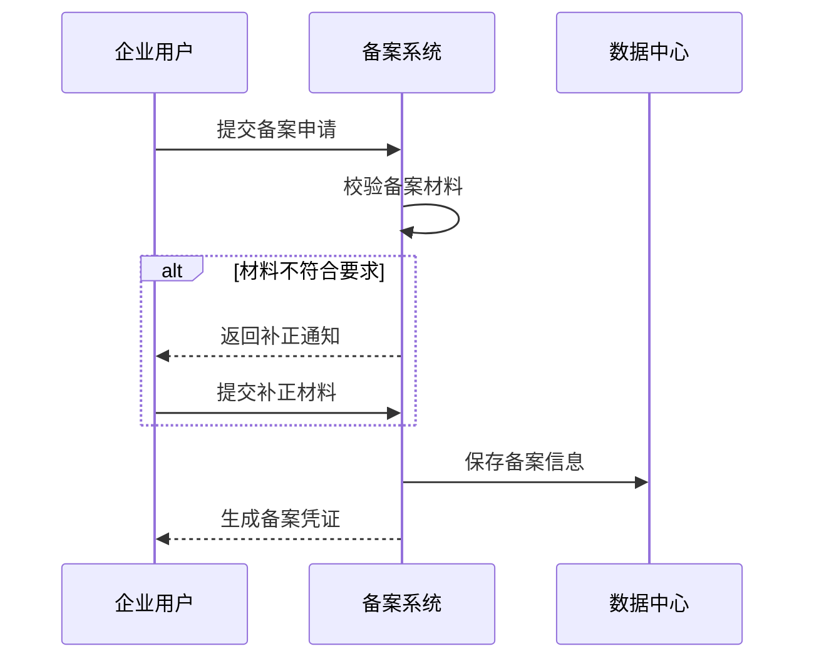
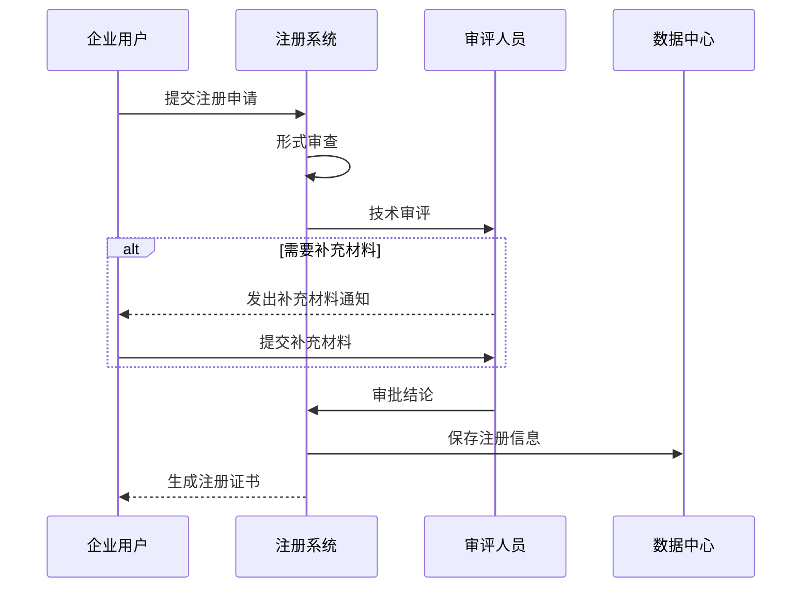
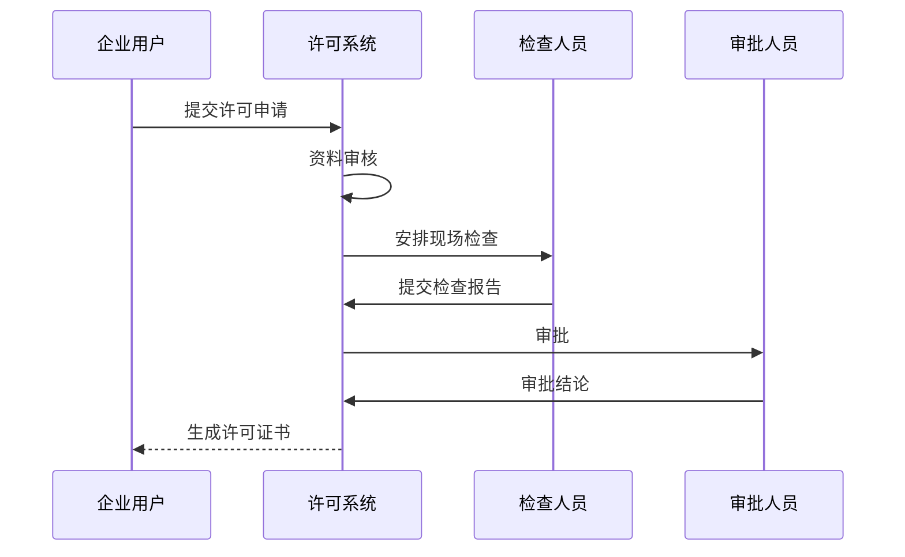
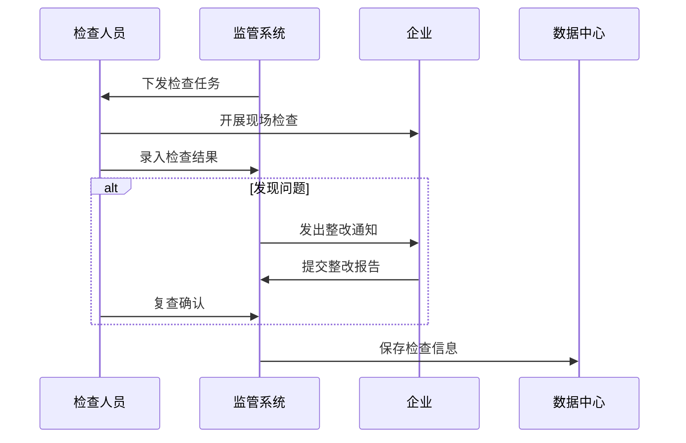
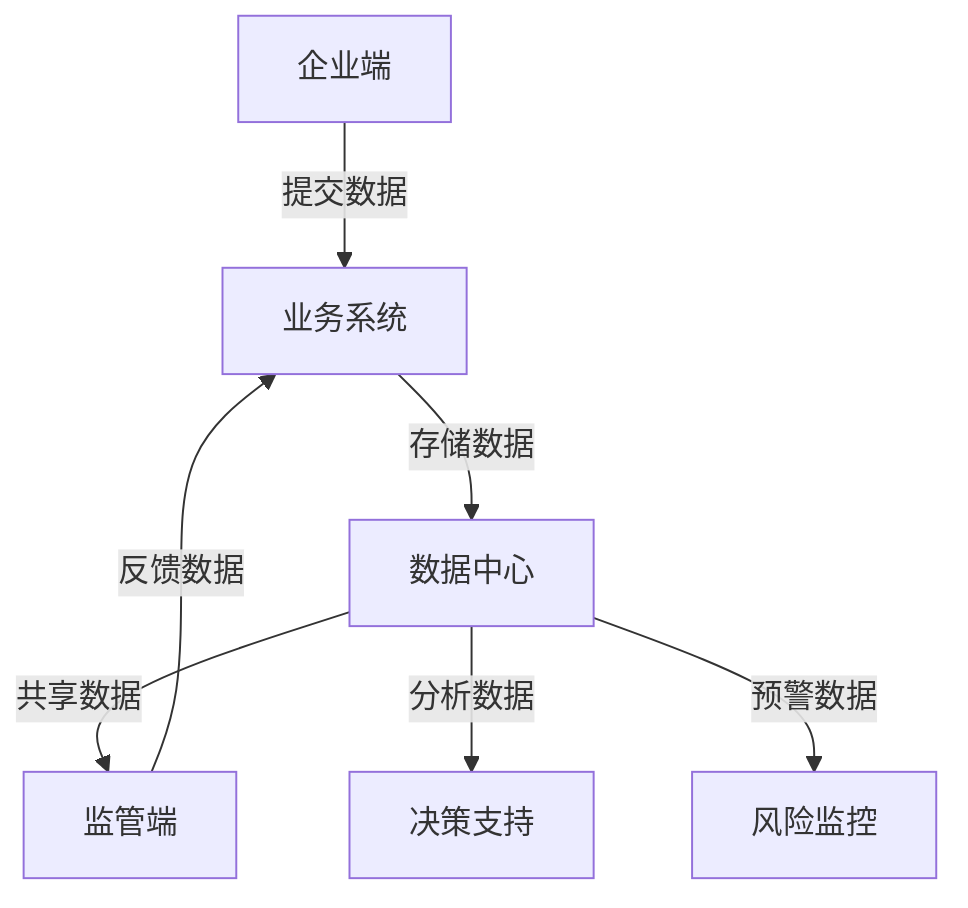

# 化妆品智慧监管系统流程设计文档

## 1. 业务流程设计

### 1.1 化妆品注册备案流程

#### 1.1.1 普通化妆品备案流程

#### 1.1.2 特殊化妆品注册流程

### 1.2 许可管理流程

#### 1.2.1 生产许可流程

### 1.3 监督检查流程

#### 1.3.1 日常监督检查

## 2. 数据流转设计

### 2.1 系统间数据交换
1. 实时数据交换
- 备案注册信息
- 许可证信息
- 检查结果信息
- 处罚信息

2. 定时数据交换
- 企业信息(每日同步)
- 产品信息(每日同步)
- 检验数据(每周同步)
- 统计数据(每月同步)

### 2.2 数据交互关系

## 3. 接口规范设计

### 3.1 接口分类
1. 数据采集接口
2. 业务处理接口
3. 查询统计接口
4. 系统集成接口

### 3.2 接口定义规范
1. 接口命名规则
   - {业务域}/{模块}/{操作}
   - 统一使用小写字母
   - 单词间使用中划线分隔

2. 接口版本控制
   - URL中包含版本号
   - 主版本号用v表示
   - 次版本号用小数点分隔

3. 接口安全规范
   - 统一认证
   - 数据加密
   - 访问控制
   - 日志记录

## 4. 异常处理机制

### 4.1 异常分类
1. 业务异常
   - 参数校验异常
   - 业务规则异常
   - 状态转换异常

2. 系统异常
   - 网络异常
   - 数据库异常
   - 服务不可用

3. 数据异常
   - 数据格式错误
   - 数据重复
   - 数据缺失

### 4.2 异常处理流程
1. 异常识别
   - 异常捕获
   - 异常分类
   - 异常定位

2. 异常处理
   - 自动处理
   - 人工介入
   - 异常升级

3. 异常反馈
   - 错误提示
   - 处理建议
   - 结果反馈

## 5. 系统集成方案

### 5.1 集成模式
1. 数据集成
   - 数据库集成
   - 文件集成
   - 消息集成

2. 接口集成
   - Web Service
   - RESTful API
   - 消息队列

3. 应用集成
   - 单点登录
   - 统一门户
   - 统一认证

### 5.2 集成规范
1. 接口规范
   - 接口定义
   - 参数规范
   - 返回格式

2. 数据规范
   - 数据格式
   - 编码规则
   - 数据映射

3. 安全规范
   - 访问控制
   - 数据加密
   - 日志审计