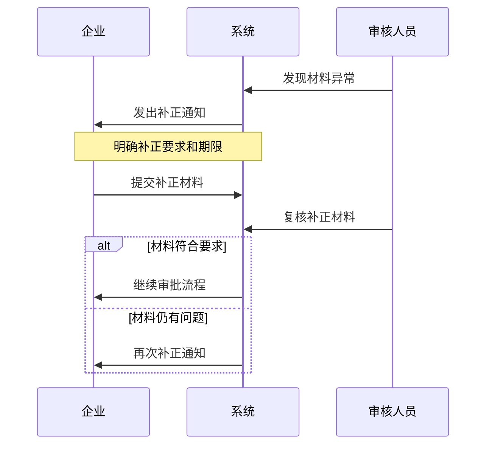

# 化妆品注册备案系统异常处理流程补充文档

## 1. 异常情况分类

### 1.1 材料异常
1. 材料不完整
- 必要文件缺失
- 必填信息空缺
- 附件损坏

2. 材料不规范
- 格式错误
- 内容不符合要求
- 签章不完整

3. 材料造假
- 虚假信息
- 材料伪造
- 数据造假

### 1.2 流程异常
1. 审批超时
- 受理超时
- 审评超时
- 审批超时

2. 系统异常
- 数据提交失败
- 系统处理错误
- 流程卡滞

3. 操作异常
- 重复提交
- 误操作
- 撤销操作

## 2. 异常处理流程

### 2.1 材料异常处理

### 2.2 流程异常处理
1. 超时处理
- 系统自动预警
- 上报处理
- 跟踪解决

2. 系统异常
- 错误提示
- 技术支持
- 应急处理

3. 操作异常
- 撤销操作
- 重新提交
- 记录留痕

## 3. 应急处理机制

### 3.1 快速响应
1. 异常报告
- 问题描述
- 影响评估
- 紧急程度

2. 处理分级
- 一般异常
- 严重异常
- 紧急异常

3. 响应时限
- 紧急异常：2小时内
- 严重异常：4小时内
- 一般异常：24小时内

### 3.2 处置流程
1. 问题确认
- 核实异常情况
- 确定影响范围
- 评估处理方案

2. 解决方案
- 制定处理方案
- 实施解决措施
- 效果验证

3. 结果反馈
- 处理结果通知
- 后续工作建议
- 满意度调查

## 4. 数据处理规则

### 4.1 数据修复
1. 数据备份
- 实时备份
- 定时备份
- 手动备份

2. 数据恢复
- 单条恢复
- 批量恢复
- 全量恢复

3. 数据校验
- 完整性校验
- 一致性校验
- 准确性校验

### 4.2 数据补偿
1. 补偿策略
- 自动补偿
- 手动补偿
- 批量补偿

2. 补偿规则
- 字段补偿
- 关系补偿
- 状态补偿

## 5. 预防措施

### 5.1 系统优化
1. 性能优化
- 并发处理
- 负载均衡
- 资源调度

2. 容错处理
- 异常捕获
- 自动重试
- 降级处理

### 5.2 运维保障
1. 监控预警
- 性能监控
- 异常监控
- 容量监控

2. 应急演练
- 定期演练
- 问题复盘
- 持续改进

## 6. 持续改进

### 6.1 问题总结
1. 异常分析
- 原因分析
- 影响评估
- 解决方案

2. 经验积累
- 案例库建设
- 知识库更新
- 最佳实践

### 6.2 制度完善
1. 流程优化
- 简化流程
- 明确职责
- 提高效率

2. 规范更新
- 完善规范
- 更新制度
- 强化培训