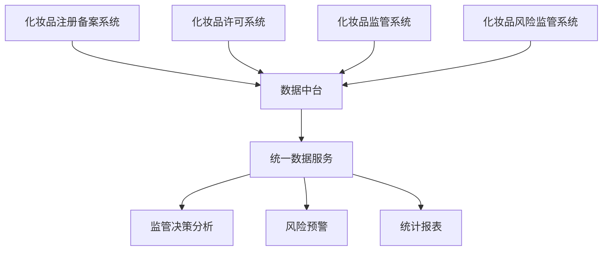

# 化妆品监管平台系统设计补充文档

## 1. 数据流转设计

### 1.1 系统间数据流转图


### 1.2 数据同步规则
1. 实时同步数据
- 许可证信息变更
- 处罚信息
- 风险预警信息

2. 定时同步数据
- 企业基础信息(每日)
- 监管检查信息(每日)
- 统计分析数据(每周)

3. 按需同步数据
- 历史数据迁移
- 专项数据导出

## 2. 业务规则补充

### 2.1 召回销毁流程
1. 召回启动
- 企业主动召回
- 责令召回
- 召回计划审核

2. 召回实施
- 召回通知发布
- 召回进度跟踪
- 召回效果评估

3. 销毁管理
- 销毁计划审批
- 现场监督销毁
- 销毁记录存档

### 2.2 培训考试管理
1. 培训管理
- 培训计划制定
- 培训课程管理
- 培训记录管理

2. 考试管理
- 题库管理
- 试卷生成
- 考试组织
- 成绩管理

3. 证书管理
- 证书生成
- 证书查验
- 证书档案

## 3. API接口补充

### 3.1 数据采集接口
```yaml
接口名称: /api/v1/cosmetics/data/collect
请求方式: POST
接口说明: 化妆品数据采集接口
请求参数:
  - name: dataType
    type: string
    required: true
    desc: 数据类型(企业/产品/许可证/检查)
  - name: content
    type: object
    required: true
    desc: 数据内容
返回参数:
  - name: code
    type: integer
    desc: 状态码
  - name: message
    type: string
    desc: 返回信息
  - name: data
    type: object
    desc: 返回数据
```

### 3.2 业务处理接口
```yaml
接口名称: /api/v1/cosmetics/business/process
请求方式: POST
接口说明: 化妆品业务处理接口
请求参数:
  - name: businessType
    type: string
    required: true
    desc: 业务类型(备案/许可/检查/召回)
  - name: businessData
    type: object
    required: true
    desc: 业务数据
安全认证:
  - type: Bearer Token
  - desc: JWT认证
错误码:
  - 200: 成功
  - 400: 参数错误
  - 401: 未授权
  - 403: 禁止访问
  - 500: 系统错误
```

## 4. 数据模型补充

### 4.1 企业信息模型
```sql
CREATE TABLE cosmetics_enterprise (
    id BIGINT PRIMARY KEY AUTO_INCREMENT,
    enterprise_name VARCHAR(200) NOT NULL COMMENT '企业名称',
    credit_code VARCHAR(18) NOT NULL COMMENT '统一社会信用代码',
    legal_person VARCHAR(50) NOT NULL COMMENT '法定代表人',
    address VARCHAR(500) NOT NULL COMMENT '注册地址',
    business_scope TEXT COMMENT '经营范围',
    license_no VARCHAR(50) COMMENT '许可证号',
    license_type TINYINT COMMENT '许可类型:1生产,2经营',
    license_status TINYINT COMMENT '许可状态:0无效,1有效',
    credit_level TINYINT COMMENT '信用等级:A,B,C,D',
    create_time DATETIME NOT NULL DEFAULT CURRENT_TIMESTAMP,
    update_time DATETIME NOT NULL DEFAULT CURRENT_TIMESTAMP ON UPDATE CURRENT_TIMESTAMP,
    UNIQUE KEY uk_credit_code(credit_code)
) ENGINE=InnoDB DEFAULT CHARSET=utf8mb4 COMMENT='化妆品企业信息表';
```

### 4.2 产品信息模型
```sql
CREATE TABLE cosmetics_product (
    id BIGINT PRIMARY KEY AUTO_INCREMENT,
    product_name VARCHAR(200) NOT NULL COMMENT '产品名称',
    product_type VARCHAR(50) NOT NULL COMMENT '产品类型',
    enterprise_id BIGINT NOT NULL COMMENT '企业ID',
    register_no VARCHAR(50) COMMENT '注册备案号',
    approval_no VARCHAR(50) COMMENT '批准文号',
    product_spec VARCHAR(200) COMMENT '规格型号',
    product_status TINYINT COMMENT '状态:0停用,1启用',
    risk_level TINYINT COMMENT '风险等级:1,2,3',
    create_time DATETIME NOT NULL DEFAULT CURRENT_TIMESTAMP,
    update_time DATETIME NOT NULL DEFAULT CURRENT_TIMESTAMP ON UPDATE CURRENT_TIMESTAMP,
    KEY idx_enterprise_id(enterprise_id)
) ENGINE=InnoDB DEFAULT CHARSET=utf8mb4 COMMENT='化妆品产品信息表';
```

## 5. 异常处理流程

### 5.1 系统异常处理
1. 数据异常
- 数据格式错误
- 数据重复
- 数据缺失

2. 业务异常
- 参数校验失败
- 业务规则冲突
- 状态转换错误

3. 系统异常
- 网络超时
- 服务不可用
- 数据库异常

### 5.2 异常处理策略
1. 实时告警
- 系统监控告警
- 业务异常告警
- 数据质量告警

2. 自动处理
- 自动重试
- 数据修复
- 服务切换

3. 人工介入
- 异常升级
- 人工处理
- 结果反馈