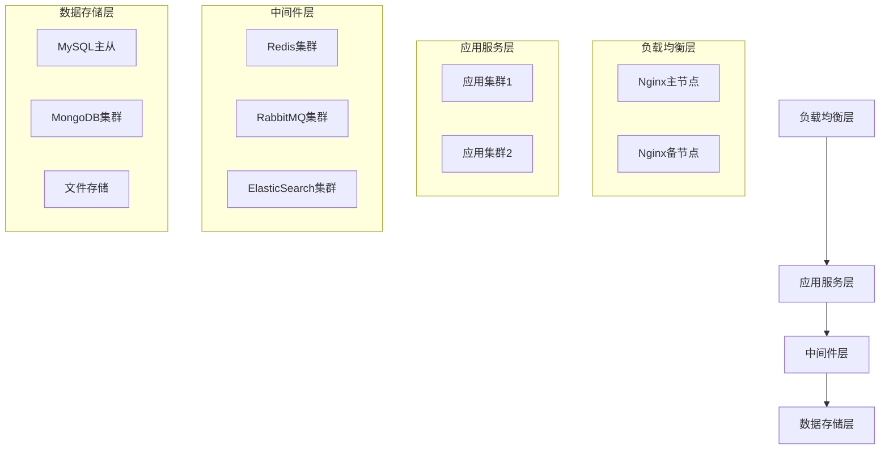

# 化妆品智慧监管平台部署运维最终文档

## 1. 部署架构设计

### 1.1 总体部署架构


### 1.2 网络架构设计
1. 网络分区
- DMZ区：负载均衡、API网关
- APP区：应用服务器集群
- DB区：数据库服务器集群
- 存储区：文件存储服务器

2. 安全设计
- 防火墙隔离
- VPN接入
- 网络监控

## 2. 环境配置规范

### 2.1 服务器配置

#### 2.1.1 硬件配置清单
1. 应用服务器
```plaintext
配置要求：
- CPU: 16核 Intel Xeon
- 内存: 32GB DDR4
- 系统盘: 500GB SSD
- 数据盘: 1TB SSD
- 网卡: 双万兆网卡
数量: 8台
```

2. 数据库服务器
```plaintext
配置要求：
- CPU: 32核 Intel Xeon
- 内存: 64GB DDR4
- 系统盘: 500GB SSD
- 数据盘: 2TB SSD RAID10
- 网卡: 双万兆网卡
数量: 4台
```

### 2.2 软件环境配置

#### 2.2.1 基础软件配置
1. 操作系统配置
```plaintext
- OS: CentOS 7.9
- 内核参数优化
- 文件系统：XFS
- 安全基线配置
```

2. 数据库配置
```plaintext
- MySQL 8.0
- MongoDB 4.4
- Redis 6.2
```

## 3. 监控告警体系

### 3.1 监控指标
1. 系统监控
- CPU使用率
- 内存使用率
- 磁盘使用率
- 网络带宽

2. 应用监控
- JVM状态
- 线程状态
- 接口响应时间
- 业务处理量

3. 数据库监控
- 连接数
- 慢查询
- 锁等待
- 主从延迟

### 3.2 告警策略
1. 告警级别
- P1级：严重告警
- P2级：重要告警
- P3级：一般告警

2. 告警渠道
- 短信告警
- 邮件告警
- 电话告警
- 工单告警

## 4. 运维流程规范

### 4.1 变更管理
1. 变更流程
- 变更申请
- 变更评估
- 变更审批
- 变更实施
- 变更验证

2. 变更规范
- 提前提交申请
- 制定回滚方案
- 选择维护窗口
- 做好变更记录

### 4.2 应急处置
1. 应急流程
- 问题发现
- 问题定位
- 问题处理
- 结果验证
- 复盘总结

2. 预案管理
- 系统故障预案
- 网络故障预案
- 数据库故障预案
- 安全事件预案

## 5. 备份恢复方案

### 5.1 备份策略
1. 数据备份
- 数据库全量备份
- 数据库增量备份
- 文件系统备份
- 配置文件备份

2. 系统备份
- 操作系统备份
- 应用系统备份
- 中间件配置备份

### 5.2 恢复策略
1. 恢复目标
- RTO ≤ 4小时
- RPO ≤ 1小时

2. 恢复流程
- 环境准备
- 数据恢复
- 系统恢复
- 验证确认

## 6. 安全运维管理

### 6.1 账号管理
1. 账号规范
- 账号命名规范
- 密码强度要求
- 权限分配原则

2. 审计管理
- 操作日志审计
- 登录日志审计
- 变更日志审计

### 6.2 漏洞管理
1. 漏洞修复
- 漏洞扫描
- 漏洞评估
- 漏洞修复
- 修复验证

2. 安全加固
- 系统加固
- 数据库加固
- 应用加固
- 网络加固

## 7. 运维文档管理

### 7.1 文档体系
1. 操作文档
- 部署文档
- 配置文档
- 运维手册
- 故障处理手册

2. 管理文档
- 运维制度
- 应急预案
- 变更规范
- 安全规范

### 7.2 文档更新
1. 更新机制
- 定期评审
- 及时更新
- 版本管理
- 变更记录

2. 培训机制
- 新人培训
- 定期培训
- 专项培训
- 考核评估