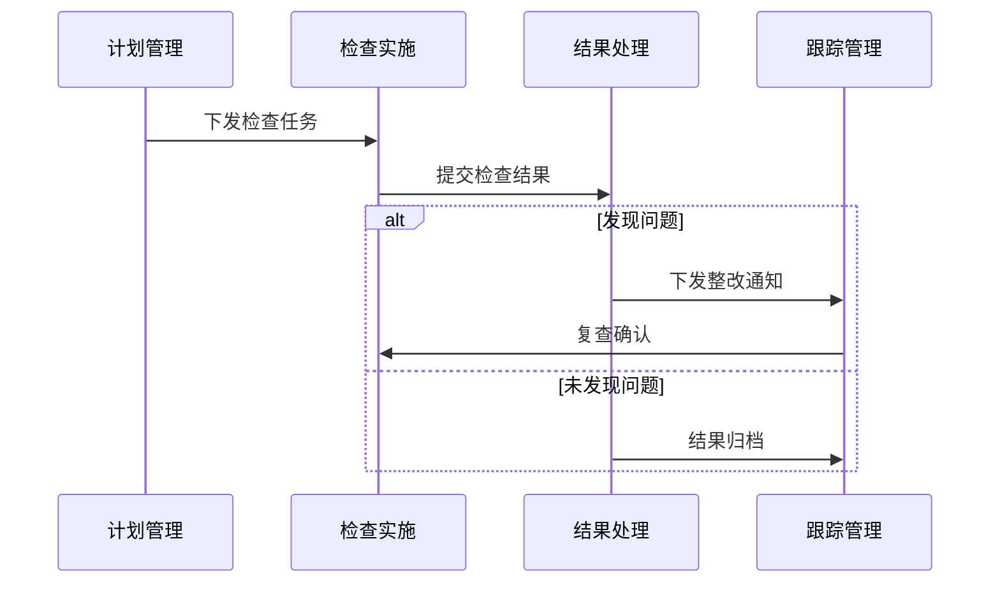
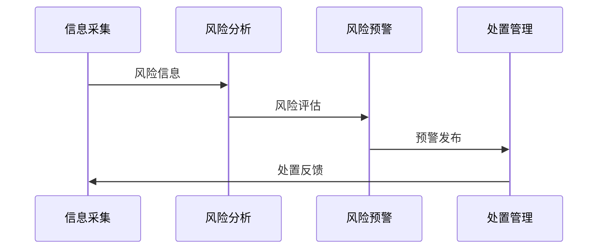

# 化妆品监管模块详细设计文档

## 1. 系统功能架构

### 1.1 功能模块划分

1. 日常监管管理
- 监管计划管理
- 现场检查管理
- 问题整改管理
- 监管档案管理

2. 风险监管管理
- 风险信息采集
- 风险评估分析
- 风险预警处置
- 风险追踪管理

3. 抽检监管管理
- 抽检计划管理
- 抽样检验管理
- 不合格处理
- 结果统计分析

## 2. 业务流程设计

### 2.1 日常监管流程


### 2.2 风险监管流程


## 3. 数据模型设计

### 3.1 核心数据表

```sql
-- 监管检查记录表
CREATE TABLE cos_inspect_record (
    id BIGINT PRIMARY KEY AUTO_INCREMENT COMMENT '主键ID',
    inspect_no VARCHAR(50) NOT NULL COMMENT '检查编号',
    enterprise_id BIGINT NOT NULL COMMENT '企业ID',
    inspect_type TINYINT COMMENT '检查类型:1日常,2专项,3飞行',
    inspect_date DATE COMMENT '检查日期',
    inspector_id BIGINT COMMENT '检查人员ID',
    inspect_result TINYINT COMMENT '检查结果:0合格,1不合格',
    problem_desc TEXT COMMENT '问题描述',
    create_time DATETIME DEFAULT CURRENT_TIMESTAMP,
    update_time DATETIME DEFAULT CURRENT_TIMESTAMP ON UPDATE CURRENT_TIMESTAMP,
    UNIQUE KEY uk_inspect_no(inspect_no),
    KEY idx_enterprise_id(enterprise_id)
) COMMENT='监管检查记录表';

-- 风险预警记录表
CREATE TABLE cos_risk_warning (
    id BIGINT PRIMARY KEY AUTO_INCREMENT COMMENT '主键ID',
    warning_no VARCHAR(50) NOT NULL COMMENT '预警编号',
    risk_type TINYINT COMMENT '风险类型',
    risk_level TINYINT COMMENT '风险等级:1,2,3',
    warning_content TEXT COMMENT '预警内容',
    warning_status TINYINT COMMENT '状态:0未处理,1已处理',
    handle_result TEXT COMMENT '处理结果',
    create_time DATETIME DEFAULT CURRENT_TIMESTAMP,
    update_time DATETIME DEFAULT CURRENT_TIMESTAMP ON UPDATE CURRENT_TIMESTAMP,
    UNIQUE KEY uk_warning_no(warning_no)
) COMMENT='风险预警记录表';
```

## 4. 接口设计

### 4.1 监管检查接口

```yaml
接口名称: /api/v1/inspect/submit
请求方式: POST
接口说明: 检查结果提交接口

请求参数:
  - name: enterpriseId
    type: long
    required: true
    desc: 企业ID
  - name: inspectType
    type: integer
    required: true
    desc: 检查类型
  - name: inspectResult
    type: integer
    required: true
    desc: 检查结果
  - name: problemDesc
    type: string
    required: false
    desc: 问题描述

返回参数:
  - name: code
    type: integer
    desc: 状态码
  - name: message
    type: string
    desc: 返回信息
  - name: data
    type: object
    desc: 检查记录
```

### 4.2 风险预警接口

```yaml
接口名称: /api/v1/risk/warning
请求方式: POST
接口说明: 风险预警发布接口

请求参数:
  - name: riskType
    type: integer
    required: true
    desc: 风险类型
  - name: riskLevel
    type: integer
    required: true
    desc: 风险等级
  - name: warningContent
    type: string
    required: true
    desc: 预警内容

返回参数:
  - name: code
    type: integer
    desc: 状态码
  - name: message
    type: string
    desc: 返回信息
  - name: data
    type: object
    desc: 预警记录
```

## 5. 系统集成设计

### 5.1 外部系统集成
1. 与注册备案系统集成
- 企业信息同步
- 产品信息同步
- 许可信息同步

2. 与数据中台集成
- 数据实时上报
- 数据分析服务
- 数据共享服务

### 5.2 数据交换规范
1. 数据交换格式
- JSON格式
- XML格式
- 二进制格式

2. 交换协议
- HTTP/HTTPS
- WebService
- 消息队列

## 6. 安全设计

### 6.1 访问控制
1. 用户认证
- 统一身份认证
- 角色权限管理
- 访问日志审计

2. 数据权限
- 数据访问控制
- 敏感数据脱敏
- 操作权限控制

### 6.2 安全防护
1. 系统安全
- 接口加密
- 数据加密
- 传输加密

2. 运行安全
- 异常监控
- 日志记录
- 应急处理

## 7. 部署方案

### 7.1 系统部署
1. 服务器配置
- 应用服务器: 8核16G
- 数据库服务器: 16核32G
- 文件服务器: 500G存储

2. 网络部署
- 负载均衡
- 双机热备
- 灾备系统

### 7.2 性能要求
1. 并发处理
- 支持100用户并发
- 响应时间<3秒
- 数据处理<1秒

2. 可用性要求
- 系统可用性>99.9%
- 数据备份策略
- 故障恢复机制