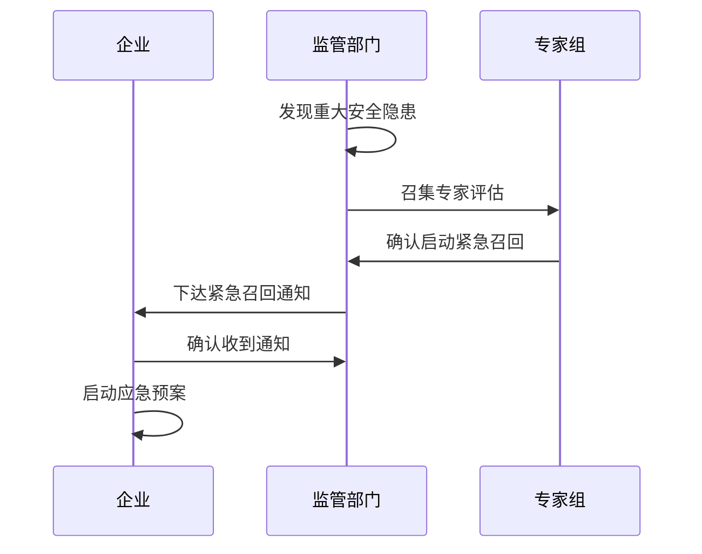

# 化妆品紧急召回处理流程补充文档

## 1. 紧急召回触发条件

### 1.1 严重安全隐患
1. 产品存在严重质量安全问题
2. 产品可能导致严重不良反应
3. 产品含有禁用物质
4. 产品存在严重微生物污染

### 1.2 重大舆情事件
1. 产品引发群体性事件
2. 媒体重点关注报道
3. 社会影响重大

## 2. 紧急召回流程

### 2.1 应急响应启动

### 2.2 召回实施要求
1. 时间要求
- 24小时内制定召回计划
- 48小时内启动召回行动
- 72小时内完成首次进展报告

2. 范围要求
- 全渠道通知
- 全批次召回
- 全地域覆盖

3. 信息通报要求
- 每日报告召回进展
- 实时报告重大情况
- 及时通报舆情信息

## 3. 应急处置措施

### 3.1 现场处置
1. 库存控制
- 立即封存库存
- 停止生产销售
- 封存相关原料

2. 市场管控
- 通知经销商停售
- 通知电商平台下架
- 通知零售终端召回

3. 物流管控
- 截停在途产品
- 统一返回处理
- 专人负责对接

### 3.2 信息处置
1. 信息发布
- 召回公告发布
- 风险提示发布
- 媒体信息发布

2. 咨询应对
- 设立24小时热线
- 建立快速响应机制
- 统一口径解答

3. 舆情管控
- 舆情监测
- 及时回应
- 正面引导

## 4. 跟踪评估机制

### 4.1 召回效果评估
1. 数据跟踪
- 召回完成率
- 召回及时率
- 消费者满意度

2. 效果分析
- 召回覆盖情况
- 处置及时情况
- 舆情控制情况

### 4.2 持续改进
1. 问题复盘
- 原因分析
- 过程评估
- 效果评价

2. 制度完善
- 完善预警机制
- 优化应急预案
- 加强培训演练

## 5. 职责分工

### 5.1 企业职责
1. 实施召回
- 制定详细计划
- 组织实施召回
- 及时报告进展

2. 善后处理
- 处理退货退款
- 赔付消费者
- 销毁问题产品

### 5.2 监管部门职责
1. 监督指导
- 督促企业召回
- 指导召回实施
- 评估召回效果

2. 行政处置
- 启动调查程序
- 依法采取措施
- 追究相关责任