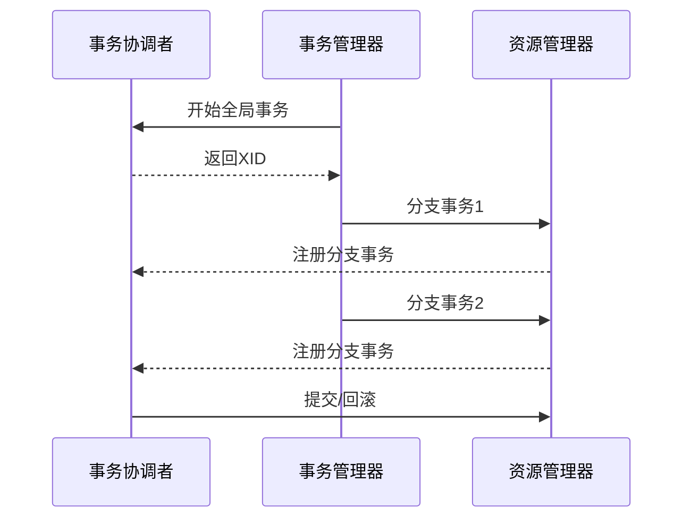

# 化妆品智慧监管平台技术架构设计补充文档

## 1. 微服务架构设计

### 1.1 服务拆分
1. 业务域划分
- 企业管理域
- 产品管理域
- 许可管理域
- 监管管理域
- 风险管理域

2. 服务清单
- 企业服务(enterprise-service)
- 产品服务(product-service)
- 许可服务(license-service)
- 监管服务(supervision-service)
- 风险服务(risk-service)
- 系统服务(system-service)

### 1.2 服务治理
1. 注册中心(Nacos)
- 服务注册
- 服务发现
- 配置管理

2. 网关(Gateway)
- 路由转发
- 负载均衡
- 限流熔断
- 安全认证

## 2. 分布式设计

### 2.1 分布式事务
1. Seata配置
- AT模式：适用于简单业务场景
- TCC模式：适用于复杂业务场景
- Saga模式：适用于长事务场景

2. 事务处理流程

### 2.2 分布式缓存
1. Redis集群
- 主从复制
- 哨兵模式
- 集群模式

2. 缓存策略
- 本地缓存
- 分布式缓存
- 多级缓存

## 3. 高可用设计

### 3.1 系统容错
1. 服务容错
- 服务降级
- 服务熔断
- 服务限流
- 服务隔离

2. 数据容错
- 数据备份
- 数据同步
- 数据恢复

### 3.2 负载均衡
1. 策略配置
- 轮询策略
- 权重策略
- 最小连接策略
- 响应时间策略

2. 健康检查
- 心跳检测
- 服务监控
- 故障转移

## 4. 性能优化

### 4.1 系统性能
1. JVM优化
- 内存分配
- GC策略
- 线程优化

2. 中间件优化
- 连接池配置
- 线程池配置
- 缓存配置

### 4.2 数据库优化
1. 索引优化
- 合理建立索引
- 避免索引失效
- 定期维护索引

2. SQL优化
- 执行计划分析
- 慢查询优化
- 分页查询优化

## 5. 安全架构

### 5.1 认证授权
1. OAuth2认证
- 授权码模式
- 密码模式
- 客户端模式
- 刷新令牌

2. JWT令牌
- 令牌生成
- 令牌验证
- 令牌刷新

### 5.2 数据安全
1. 传输安全
- HTTPS加密
- 数据加密
- 签名验证

2. 存储安全
- 敏感数据加密
- 数据脱敏
- 访问控制

## 6. 监控运维

### 6.1 监控体系
1. 系统监控
- 服务器监控
- 应用监控
- 数据库监控
- 缓存监控

2. 业务监控
- 接口调用监控
- 业务指标监控
- 异常监控

### 6.2 日志体系
1. 日志收集
- 应用日志
- 系统日志
- 审计日志

2. 日志分析
- 实时分析
- 离线分析
- 告警分析

## 7. 扩展性设计

### 7.1 水平扩展
1. 应用扩展
- 集群部署
- 负载均衡
- 会话共享

2. 存储扩展
- 分库分表
- 读写分离
- 数据分片

### 7.2 垂直扩展
1. 功能扩展
- 插件机制
- 模块化设计
- 配置化设计

2. 接口扩展
- 接口版本控制
- 接口兼容性
- 接口扩展性