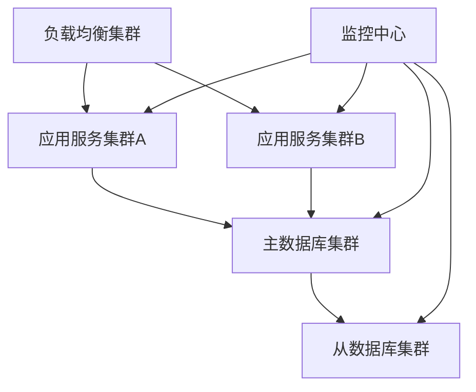

# 化妆品智慧监管平台故障转移方案设计

## 1. 故障转移架构

### 1.1 总体架构

### 1.2 故障转移层次
1. 应用层转移
- 服务实例切换
- 负载均衡切换
- 会话保持处理

2. 数据层转移
- 数据库主从切换
- 缓存集群切换
- 消息队列切换

## 2. 故障检测机制

### 2.1 健康检查
1. 检查项目
- 服务健康状态
- 系统资源状态
- 网络连接状态
- 数据同步状态

2. 检查方式
- 心跳检测
- 端口检测
- 服务检测
- 数据检测

### 2.2 故障判定
1. 判定规则
- 响应超时
- 服务不可用
- 资源耗尽
- 数据异常

2. 阈值设置
- 响应时间 > 3秒
- 失败率 > 50%
- CPU使用率 > 90%
- 内存使用率 > 90%

## 3. 自动切换策略

### 3.1 应用切换
1. 切换条件
- 服务不可用
- 性能严重下降
- 系统资源耗尽

2. 切换流程
- 停止流量进入
- 切换服务节点
- 恢复流量导入
- 验证服务状态

### 3.2 数据库切换
1. 主从切换
- 确认主库故障
- 选举新主库
- 更新路由信息
- 验证数据一致性

2. 读写分离
- 读库故障切换
- 写库故障切换
- 负载均衡调整
- 连接池刷新

## 4. 数据同步机制

### 4.1 实时同步
1. 数据库同步
- 半同步复制
- 位点检查
- 数据校验
- 延迟监控

2. 缓存同步
- 双写一致性
- 失效更新
- 延迟清理
- 版本控制

### 4.2 故障恢复
1. 数据补偿
- 差异识别
- 数据修复
- 一致性检查
- 业务确认

2. 状态恢复
- 会话恢复
- 事务回滚
- 服务重启
- 缓存重建

## 5. 监控告警

### 5.1 监控指标
1. 系统监控
- CPU负载
- 内存使用
- 磁盘IO
- 网络流量

2. 服务监控
- 服务状态
- 响应时间
- 错误率
- QPS/TPS

### 5.2 告警管理
1. 告警规则
- 阈值告警
- 趋势告警
- 状态告警
- 组合告警

2. 通知方式
- 短信通知
- 邮件通知
- 电话通知
- 工单通知

## 6. 应急预案

### 6.1 快速响应
1. 响应流程
- 问题发现
- 故障定级
- 团队响应
- 处置执行

2. 处置措施
- 应急切换
- 故障隔离
- 服务恢复
- 原因分析

### 6.2 演练计划
1. 演练内容
- 故障模拟
- 切换演练
- 恢复演练
- 回滚演练

2. 演练要求
- 定期执行
- 过程记录
- 效果评估
- 持续改进