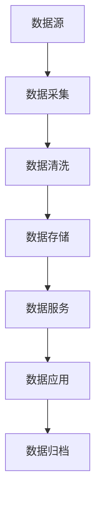

# 数据中台补充设计文档

## 1. 数据治理详细规范

### 1.1 数据标准规范

#### 1.1.1 基础数据标准
1. 编码规范
- 企业编码规则
- 产品编码规则
- 许可证编码规则
- 文档编码规则

2. 命名规范
- 数据库命名规范
- 表命名规范
- 字段命名规范
- 索引命名规范

3. 基础字典
- 行政区划代码
- 产品类别代码
- 企业类型代码
- 许可类型代码

#### 1.1.2 业务数据标准
1. 主数据定义
- 企业主数据
- 产品主数据
- 许可证主数据
- 人员主数据

2. 业务规则
- 数据采集规则
- 数据验证规则
- 数据转换规则
- 数据归档规则

### 1.2 数据质量管理制度

#### 1.2.1 数据质量标准
1. 完整性标准
- 必填字段要求
- 数据覆盖要求
- 数据完整率要求

2. 准确性标准
- 数据格式要求
- 数据值域要求
- 数据逻辑要求

3. 时效性标准
- 数据更新周期
- 数据同步时效
- 数据保留期限

#### 1.2.2 质量监控机制
1. 质量检查
- 定期检查机制
- 实时监控机制
- 异常预警机制

2. 质量评估
- 质量评估指标
- 评估周期设定
- 评估报告制度

3. 质量改进
- 问题跟踪机制
- 整改验收机制
- 持续优化机制

### 1.3 数据安全管理制度

#### 1.3.1 安全策略
1. 访问控制
- 用户认证机制
- 权限管理机制
- 访问审计机制

2. 数据加密
- 传输加密方案
- 存储加密方案
- 密钥管理方案

3. 安全审计
- 操作日志记录
- 安全事件监控
- 审计报告制度

#### 1.3.2 应急预案
1. 数据备份
- 备份策略制定
- 备份执行监控
- 恢复演练制度

2. 灾难恢复
- 灾备系统建设
- 应急响应流程
- 恢复验证机制

## 2. 数据流转设计

### 2.1 数据流转图

### 2.2 数据流转规则
1. 实时数据流转
- 业务数据实时同步
- 关键数据实时更新
- 预警信息实时推送

2. 定时数据流转
- 每日数据同步
- 每周数据汇总
- 每月数据归档

3. 批量数据流转
- 历史数据迁移
- 大量数据导入
- 数据定期归档

## 3. 性能优化方案

### 3.1 数据库优化
1. 索引优化
- 合理创建索引
- 定期维护索引
- 优化查询语句

2. 分区策略
- 按时间分区
- 按业务分区
- 按地域分区

3. 缓存策略
- 多级缓存设计
- 缓存更新机制
- 缓存失效策略

### 3.2 服务优化
1. 服务集群
- 负载均衡
- 服务容错
- 动态扩容

2. 并发处理
- 线程池管理
- 队列控制
- 限流策略

3. 资源调度
- CPU资源调度
- 内存资源调度
- IO资源调度

## 4. 监控预警机制

### 4.1 系统监控
1. 性能监控
- CPU使用率
- 内存使用率
- 磁盘使用率
- 网络带宽

2. 服务监控
- 服务可用性
- 响应时间
- 并发数
- 错误率

3. 数据监控
- 数据量统计
- 数据质量
- 数据同步状态

### 4.2 预警机制
1. 预警规则
- 阈值设置
- 规则配置
- 级别定义

2. 预警方式
- 系统告警
- 短信通知
- 邮件通知

3. 预警处理
- 问题定位
- 处理流程
- 结果反馈