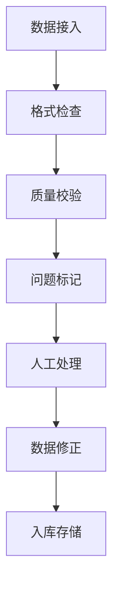

# 数据中台补充设计文档 - 数据采集与标准化管理

## 1. 数据采集架构设计

### 1.1 数据源管理
1. 内部数据源
- 注册备案系统数据
- 许可管理系统数据
- 监管检查系统数据
- 风险监测系统数据

2. 外部数据源
- 国家局数据
- 政务服务数据
- 第三方检测数据
- 舆情监测数据

### 1.2 采集方式设计
1. 实时采集
- WebService接口
- 消息队列
- 数据订阅
- 实时推送

2. 准实时采集
- 定时任务
- 增量同步
- 批量导入
- 文件传输

### 1.3 采集任务管理
1. 任务配置
- 数据源配置
- 采集规则配置
- 调度策略配置
- 异常处理配置

2. 任务监控
- 运行状态监控
- 数据量监控
- 延迟监控
- 异常监控

## 2. 数据标准化管理

### 2.1 数据标准规范

#### 2.1.1 编码标准
1. 企业编码规则
```plaintext
规则说明：区域码(6位)+行业码(2位)+顺序号(4位)
示例：120101CB0001
```

2. 产品编码规则
```plaintext
规则说明：品类码(4位)+企业码(6位)+产品序号(4位)
示例：1001120101A001
```

3. 许可证编码规则
```plaintext
规则说明：许可类型(2位)+年份(4位)+顺序号(4位)
示例：SC20240001
```

#### 2.1.2 数据格式标准
1. 时间日期格式
- 日期格式：YYYY-MM-DD
- 时间格式：HH:mm:ss
- 时间戳格式：YYYY-MM-DD HH:mm:ss

2. 数值类型格式
- 整数：不带小数点
- 小数：保留2位小数
- 百分比：小数表示

3. 字符串格式
- 编码：UTF-8
- 长度：按需定义
- 特殊字符：转义处理

### 2.2 数据质量控制

#### 2.2.1 质量检查规则
1. 完整性检查
- 必填字段检查
- 数据缺失检查
- 数据覆盖检查

2. 准确性检查
- 数据格式检查
- 数据范围检查
- 逻辑关系检查

3. 一致性检查
- 跨表一致性
- 跨系统一致性
- 历史数据一致性

#### 2.2.2 质量控制流程


### 2.3 数据清洗规则

#### 2.3.1 基础清洗
1. 空值处理
- NULL值处理
- 空字符处理
- 默认值填充

2. 格式统一
- 日期格式统一
- 数值格式统一
- 字符串格式统一

3. 重复值处理
- 重复记录识别
- 重复数据合并
- 历史记录保留

#### 2.3.2 业务清洗
1. 数据转换
- 代码转换
- 单位转换
- 格式转换

2. 数据标准化
- 名称规范化
- 地址标准化
- 手机号标准化

3. 数据验证
- 业务规则验证
- 关联关系验证
- 逻辑一致性验证

## 3. 数据质量评估

### 3.1 评估指标
1. 完整性指标
- 字段完整率
- 记录完整率
- 数据覆盖率

2. 准确性指标
- 数据准确率
- 错误率统计
- 异常率统计

3. 时效性指标
- 数据更新及时率
- 处理时延统计
- 同步延迟统计

### 3.2 评估报告
1. 日常评估报告
- 数据量统计
- 质量问题统计
- 处理情况统计

2. 周期评估报告
- 质量趋势分析
- 问题分布分析
- 改进建议