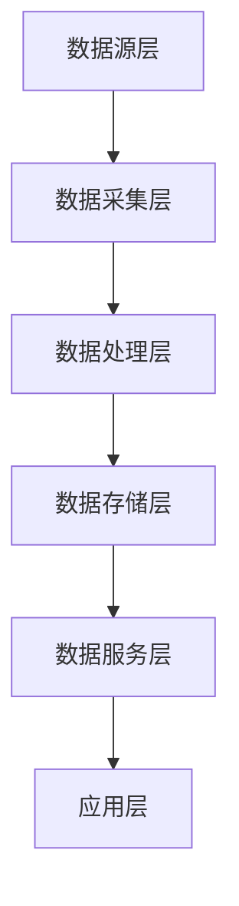

# 化妆品监管数据中台详细设计文档

## 1. 系统总体架构

### 1.1 架构设计原则
1. 统一性：统一数据标准和规范
2. 可靠性：确保数据安全和稳定
3. 扩展性：支持业务快速扩展
4. 实时性：保证数据及时性

### 1.2 系统架构图


## 2. 数据架构设计

### 2.1 数据分层
1. ODS层(原始数据层)
- 保持数据原貌
- 完整历史记录
- 不做加工处理

2. DWD层(明细数据层)
- 统一数据格式
- 数据质量校验
- 业务规则处理

3. DWS层(汇总数据层)
- 主题数据汇总
- 多维度分析
- 指标计算

4. ADS层(应用数据层)
- 业务指标
- 分析报表
- 数据服务

### 2.2 数据模型设计
1. 维度模型
- 企业维度
- 产品维度
- 时间维度
- 地域维度

2. 事实表
- 许可记录
- 检查记录
- 抽检记录
- 处罚记录

## 3. 数据采集方案

### 3.1 采集方式
1. 实时采集
- 接口对接
- 消息队列
- 数据推送

2. 定时采集
- 数据接口
- 文件传输
- 数据爬虫

3. 批量采集
- 数据导入
- 文件解析
- 批处理任务

### 3.2 采集规范
1. 接口规范
```yaml
# API接口规范
接口格式: RESTful
请求方式: POST/GET
数据格式: JSON
编码格式: UTF-8
认证方式: Token
调用限制: 
  - QPS: 100
  - 超时时间: 10s
```

2. 文件规范
- 命名规则
- 格式要求
- 传输方式

## 4. 数据处理流程

### 4.1 数据清洗
1. 格式统一
- 日期格式统一
- 编码格式统一
- 数值类型统一

2. 数据校验
- 完整性校验
- 准确性校验
- 一致性校验

3. 质量控制
- 异常检测
- 错误修正
- 缺失处理

### 4.2 数据转换
1. 映射转换
- 代码映射
- 值域转换
- 格式转换

2. 计算转换
- 指标计算
- 统计汇总
- 关联分析

## 5. 数据服务设计

### 5.1 服务分类
1. 基础服务
- 数据查询服务
- 数据统计服务
- 数据分析服务

2. 业务服务
- 监管分析服务
- 风险预警服务
- 决策支持服务

### 5.2 接口设计
1. 查询接口
```yaml
接口名称: /api/v1/data/query
请求方式: POST
接口说明: 通用数据查询接口

请求参数:
  - name: dataType
    type: string
    required: true
    desc: 数据类型
  - name: conditions
    type: object
    required: true
    desc: 查询条件

返回参数:
  - name: code
    type: integer
    desc: 状态码
  - name: message
    type: string
    desc: 返回信息
  - name: data
    type: object
    desc: 查询结果
```

2. 分析接口
```yaml
接口名称: /api/v1/data/analyze
请求方式: POST
接口说明: 数据分析接口

请求参数:
  - name: analyzeType
    type: string
    required: true
    desc: 分析类型
  - name: dimensions
    type: array
    required: true
    desc: 分析维度
  - name: metrics
    type: array
    required: true
    desc: 分析指标

返回参数:
  - name: code
    type: integer
    desc: 状态码
  - name: message
    type: string
    desc: 返回信息
  - name: data
    type: object
    desc: 分析结果
```

## 6. 性能优化设计

### 6.1 存储优化
1. 分库分表
- 按时间分表
- 按业务分库
- 冷热数据分离

2. 索引优化
- 合理建立索引
- 优化查询语句
- 定期维护索引

### 6.2 查询优化
1. 缓存策略
- 多级缓存
- 分布式缓存
- 缓存预热

2. SQL优化
- 执行计划优化
- 查询重写
- 参数优化

## 7. 安全管理

### 7.1 数据安全
1. 访问控制
- 身份认证
- 权限管理
- 操作审计

2. 数据加密
- 传输加密
- 存储加密
- 脱敏处理

### 7.2 系统安全
1. 系统防护
- 防火墙
- 入侵检测
- 漏洞扫描

2. 运维安全
- 账号管理
- 日志审计
- 备份恢复