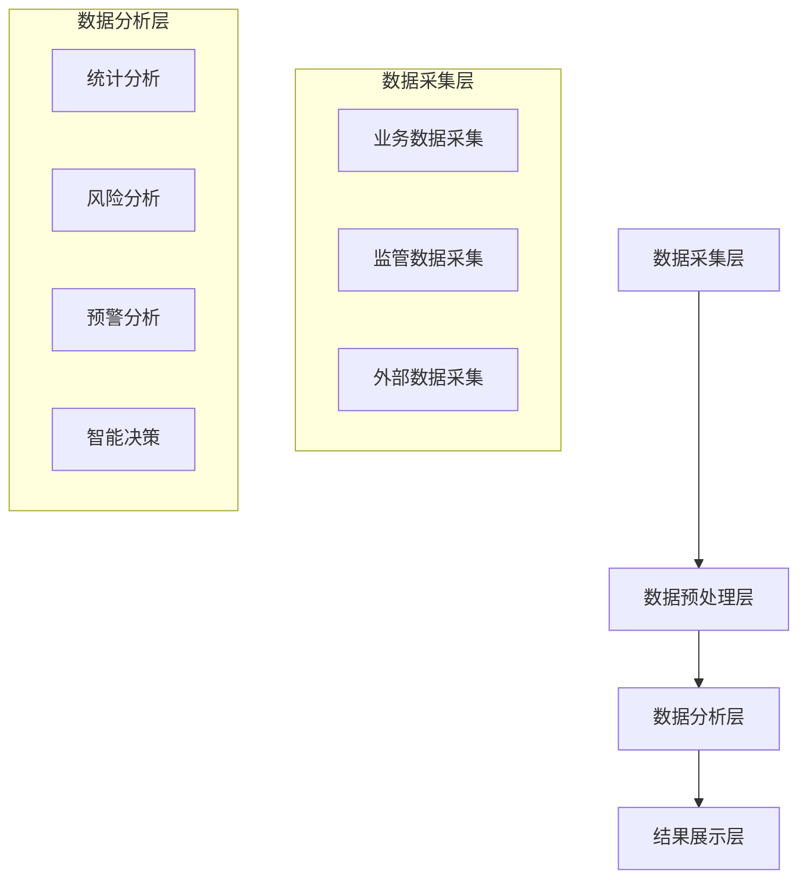

# 化妆品智慧监管平台数据分析方案设计

## 1. 数据分析架构

### 1.1 总体架构

### 1.2 技术选型
1. 数据处理
- Spark：分布式计算
- Flink：实时计算
- Hive：数据仓库
- Elasticsearch：搜索分析

2. 机器学习
- TensorFlow：深度学习
- Scikit-learn：机器学习
- XGBoost：梯度提升
- LightGBM：决策树

## 2. 分析模型设计

### 2.1 风险评估模型
1. 企业风险评估
- 基础信息评估
- 生产经营评估
- 质量管理评估
- 历史记录评估

2. 产品风险评估
- 配方风险评估
- 生产风险评估
- 质量风险评估
- 投诉风险评估

### 2.2 预警模型设计
1. 异常检测模型
- 数据异常检测
- 行为异常检测
- 趋势异常检测
- 关联异常检测

2. 风险预警模型
- 实时预警模型
- 趋势预警模型
- 组合预警模型
- 级联预警模型

## 3. 分析指标体系

### 3.1 监管指标
1. 基础指标
- 企业合规率
- 产品合格率
- 检查完成率
- 整改完成率

2. 风险指标
- 企业风险等级
- 产品风险等级
- 区域风险等级
- 行业风险等级

### 3.2 决策指标
1. 监管效能指标
- 监管覆盖率
- 问题发现率
- 整改有效率
- 预警准确率

2. 发展指标
- 行业增长率
- 市场集中度
- 创新能力指标
- 质量提升指标

## 4. 分析流程设计

### 4.1 数据处理流程
1. 数据清洗
- 缺失值处理
- 异常值处理
- 重复值处理
- 标准化处理

2. 特征工程
- 特征提取
- 特征选择
- 特征转换
- 特征编码

### 4.2 分析流程
1. 实时分析
- 数据实时采集
- 实时特征计算
- 模型实时预测
- 结果实时推送

2. 离线分析
- 批量数据处理
- 周期性分析
- 定期报告生成
- 趋势分析更新

## 5. 结果应用方案

### 5.1 可视化展示
1. 监管驾驶舱
- 实时监控
- 风险预警
- 统计分析
- 决策支持

2. 分析报表
- 定期报告
- 专题分析
- 趋势分析
- 对比分析

### 5.2 决策支持
1. 监管决策
- 检查任务分配
- 风险防控建议
- 资源调配优化
- 政策制定支持

2. 预警响应
- 风险预警推送
- 处置建议生成
- 效果评估反馈
- 预案优化建议

## 6. 效果评估方案

### 6.1 模型评估
1. 效果指标
- 准确率
- 召回率
- F1分数
- AUC值

2. 评估方法
- 交叉验证
- A/B测试
- 对比实验
- 长期跟踪

### 6.2 应用评估
1. 业务效果
- 监管效率提升
- 风险防控效果
- 决策支持价值
- 成本节约效果

2. 系统效果
- 系统性能
- 可用性
- 可扩展性
- 维护成本