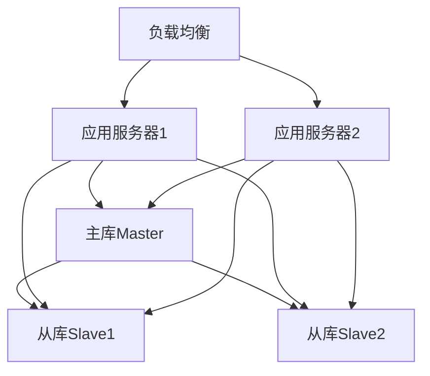

# 化妆品智慧监管平台数据库设计文档

## 1. 数据库架构设计

### 1.1 数据库集群架构


### 1.2 数据库规划
1. 业务库
- 企业信息库
- 产品信息库
- 许可证库
- 监管信息库

2. 日志库
- 操作日志库
- 审计日志库
- 系统日志库

## 2. 核心表设计

### 2.1 企业信息表
```sql
CREATE TABLE t_enterprise (
    id BIGINT PRIMARY KEY AUTO_INCREMENT COMMENT '主键ID',
    enterprise_name VARCHAR(200) NOT NULL COMMENT '企业名称',
    credit_code VARCHAR(18) NOT NULL COMMENT '统一社会信用代码',
    legal_person VARCHAR(50) NOT NULL COMMENT '法定代表人',
    phone VARCHAR(20) COMMENT '联系电话',
    address VARCHAR(500) COMMENT '企业地址',
    license_type TINYINT COMMENT '许可类型:1生产,2经营',
    enterprise_status TINYINT DEFAULT 1 COMMENT '状态:0注销,1正常',
    create_time DATETIME DEFAULT CURRENT_TIMESTAMP,
    update_time DATETIME DEFAULT CURRENT_TIMESTAMP ON UPDATE CURRENT_TIMESTAMP,
    UNIQUE KEY uk_credit_code(credit_code),
    KEY idx_enterprise_name(enterprise_name),
    KEY idx_create_time(create_time)
) ENGINE=InnoDB DEFAULT CHARSET=utf8mb4 COMMENT='企业信息表';
```

### 2.2 产品信息表
```sql
CREATE TABLE t_product (
    id BIGINT PRIMARY KEY AUTO_INCREMENT COMMENT '主键ID',
    product_name VARCHAR(200) NOT NULL COMMENT '产品名称',
    product_code VARCHAR(50) NOT NULL COMMENT '产品编码',
    enterprise_id BIGINT NOT NULL COMMENT '企业ID',
    category_id BIGINT NOT NULL COMMENT '类别ID',
    spec VARCHAR(100) COMMENT '规格',
    ingredient TEXT COMMENT '成分',
    product_status TINYINT DEFAULT 1 COMMENT '状态:0下架,1上架',
    create_time DATETIME DEFAULT CURRENT_TIMESTAMP,
    update_time DATETIME DEFAULT CURRENT_TIMESTAMP ON UPDATE CURRENT_TIMESTAMP,
    KEY idx_enterprise_id(enterprise_id),
    KEY idx_category_id(category_id)
) ENGINE=InnoDB DEFAULT CHARSET=utf8mb4 COMMENT='产品信息表';
```

### 2.3 许可证表
```sql
CREATE TABLE t_license (
    id BIGINT PRIMARY KEY AUTO_INCREMENT COMMENT '主键ID',
    license_no VARCHAR(50) NOT NULL COMMENT '许可证号',
    enterprise_id BIGINT NOT NULL COMMENT '企业ID',
    license_type TINYINT COMMENT '许可类型:1生产,2经营',
    valid_start DATE COMMENT '有效期开始',
    valid_end DATE COMMENT '有效期结束',
    license_status TINYINT DEFAULT 1 COMMENT '状态:0无效,1有效',
    create_time DATETIME DEFAULT CURRENT_TIMESTAMP,
    update_time DATETIME DEFAULT CURRENT_TIMESTAMP ON UPDATE CURRENT_TIMESTAMP,
    UNIQUE KEY uk_license_no(license_no),
    KEY idx_enterprise_id(enterprise_id)
) ENGINE=InnoDB DEFAULT CHARSET=utf8mb4 COMMENT='许可证表';
```

### 2.4 检查记录表
```sql
CREATE TABLE t_inspection (
    id BIGINT PRIMARY KEY AUTO_INCREMENT COMMENT '主键ID',
    enterprise_id BIGINT NOT NULL COMMENT '企业ID',
    inspector_id BIGINT NOT NULL COMMENT '检查人ID',
    inspect_type TINYINT COMMENT '检查类型:1日常,2专项',
    inspect_result TINYINT COMMENT '检查结果:0不合格,1合格',
    problem_desc TEXT COMMENT '问题描述',
    inspect_date DATE COMMENT '检查日期',
    create_time DATETIME DEFAULT CURRENT_TIMESTAMP,
    update_time DATETIME DEFAULT CURRENT_TIMESTAMP ON UPDATE CURRENT_TIMESTAMP,
    KEY idx_enterprise_id(enterprise_id),
    KEY idx_inspector_id(inspector_id)
) ENGINE=InnoDB DEFAULT CHARSET=utf8mb4 COMMENT='检查记录表';
```

## 3. 数据库优化

### 3.1 索引优化
1. 索引策略
- 常用查询字段建立索引
- 避免索引重复和冗余
- 控制索引数量
- 定期维护索引

2. 索引类型
- 普通索引
- 唯一索引
- 联合索引
- 全文索引

### 3.2 分库分表
1. 分库策略
- 按业务分库
- 按地区分库
- 按时间分库

2. 分表策略
- 按ID范围分表
- 按时间范围分表
- 按哈希值分表

## 4. 数据安全

### 4.1 安全策略
1. 访问控制
- 用户权限管理
- 角色权限控制
- 数据权限控制

2. 数据加密
- 敏感数据加密
- 传输数据加密
- 备份数据加密

### 4.2 审计日志
1. 操作审计
- 数据变更记录
- 用户操作记录
- 异常操作记录

2. 系统审计
- 登录日志
- 性能日志
- 错误日志

## 5. 备份恢复

### 5.1 备份策略
1. 全量备份
- 每周一次全量备份
- 备份数据加密存储
- 异地备份存储

2. 增量备份
- 每日增量备份
- binlog日志备份
- 实时同步备份

### 5.2 恢复策略
1. 数据恢复
- 快速恢复方案
- 按时间点恢复
- 验证恢复结果

2. 容灾恢复
- 主从切换
- 数据同步
- 服务恢复