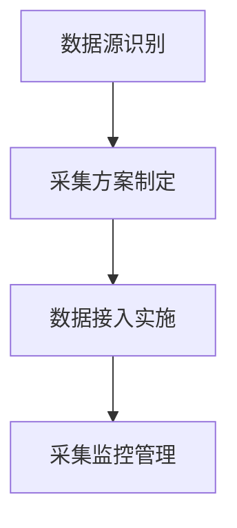
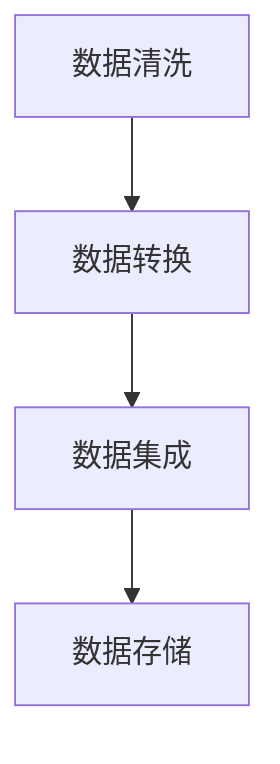
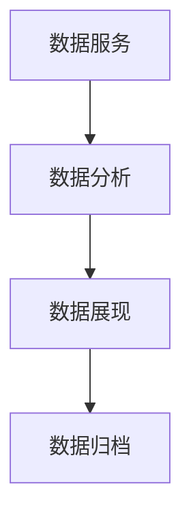

# 化妆品监管平台数据治理流程补充文档

## 1. 数据治理体系

### 1.1 治理组织架构
1. 数据治理委员会
- 决策层：制定数据治理战略
- 管理层：负责具体实施
- 执行层：执行具体任务

2. 职责分工
- 数据管理员：负责数据标准
- 数据架构师：负责数据模型
- 数据分析师：负责数据分析
- 数据运维：负责数据运营

### 1.2 治理制度框架
1. 数据标准管理制度
- 数据采集标准
- 数据处理标准
- 数据存储标准
- 数据应用标准

2. 数据质量管理制度
- 质量评估标准
- 质量控制流程
- 质量改进机制

## 2. 数据治理流程

### 2.1 数据全生命周期管理
1. 数据采集阶段

2. 数据处理阶段

3. 数据应用阶段

### 2.2 数据质量管理
1. 质量检查流程
- 数据源质量检查
- 处理过程质量检查
- 应用结果质量检查

2. 问题处理流程
- 问题发现与记录
- 问题分析与定位
- 问题解决与验证

## 3. 数据标准执行

### 3.1 数据标准实施
1. 标准发布
- 标准制定
- 标准审核
- 标准发布

2. 标准执行
- 执行计划
- 执行监控
- 执行评估

### 3.2 标准维护更新
1. 定期评估
- 适用性评估
- 执行情况评估
- 效果评估

2. 动态更新
- 更新需求收集
- 更新方案制定
- 更新实施管理

## 4. 数据质量控制

### 4.1 质量控制点设置
1. 采集环节
- 数据源质量控制
- 采集过程控制
- 采集结果控制

2. 处理环节
- 清洗质量控制
- 转换质量控制
- 加工质量控制

3. 应用环节
- 服务质量控制
- 分析质量控制
- 展现质量控制

### 4.2 质量监控指标
1. 完整性指标
- 字段完整率
- 记录完整率
- 数据覆盖率

2. 准确性指标
- 数据准确率
- 格式正确率
- 逻辑正确率

3. 及时性指标
- 数据更新及时率
- 处理时效率
- 服务响应率

## 5. 数据安全管控

### 5.1 安全管控措施
1. 访问控制
- 用户认证管理
- 权限分配管理
- 访问审计管理

2. 数据保护
- 传输加密保护
- 存储加密保护
- 使用过程保护

### 5.2 安全审计
1. 审计内容
- 操作行为审计
- 访问记录审计
- 变更记录审计

2. 审计管理
- 审计日志采集
- 审计分析处理
- 审计报告生成

## 6. 持续改进机制

### 6.1 评估机制
1. 定期评估
- 月度评估
- 季度评估
- 年度评估

2. 评估维度
- 数据质量评估
- 治理效果评估
- 应用效果评估

### 6.2 改进流程
1. 问题识别
- 问题收集
- 问题分析
- 问题分类

2. 改进实施
- 改进方案制定
- 改进措施实施
- 改进效果评估