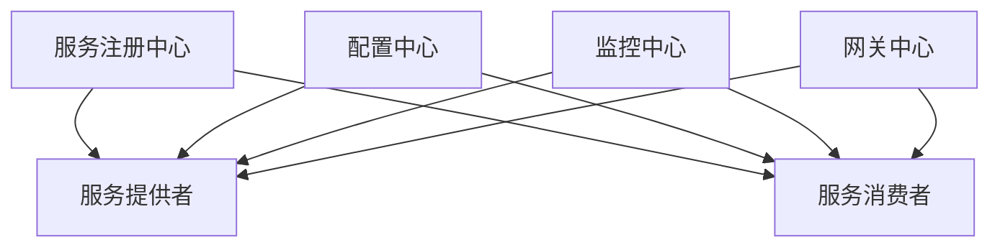

# 化妆品智慧监管平台服务治理详细方案

## 1. 服务治理架构

### 1.1 总体架构


### 1.2 核心组件
1. 服务注册与发现(Nacos)
- 服务注册
- 服务发现
- 健康检查
- 配置管理

2. 网关(Gateway)
- 路由转发
- 负载均衡
- 限流熔断
- 安全认证

3. 监控中心(Sentinel)
- 实时监控
- 流量控制
- 熔断降级
- 系统保护

## 2. 服务治理策略

### 2.1 服务注册与发现
1. 服务注册规则
```yaml
服务命名规范:
  格式: ${系统名}-${模块名}-${服务名}
  示例: cosmetic-license-service

服务分组规则:
  开发环境: DEV
  测试环境: TEST
  生产环境: PROD
```

2. 服务发现策略
- 轮询策略
- 权重策略
- 就近策略
- 故障转移

### 2.2 服务降级策略
1. 降级触发条件
- 服务响应超时
- 服务错误率高
- 系统负载过高
- 资源不足

2. 降级处理方案
- 返回默认值
- 本地缓存
- 服务降级
- 功能降级

## 3. 流量控制方案

### 3.1 限流策略
1. QPS限流
- 接口级别限流
- 服务级别限流
- 用户级别限流

2. 并发线程限流
- 线程池隔离
- 信号量隔离
- 动态调整

### 3.2 熔断策略
1. 熔断规则
- 慢调用比例
- 异常比例
- 异常数策略

2. 熔断恢复
- 半开状态试探
- 渐进式恢复
- 快速熔断

## 4. 监控告警方案

### 4.1 监控指标
1. 服务监控
- 服务可用性
- 响应时间
- 并发数
- TPS/QPS

2. 资源监控
- CPU使用率
- 内存使用率
- 线程使用情况
- 连接池状态

### 4.2 告警规则
1. 服务告警
- 服务不可用
- 服务超时
- 错误率过高

2. 资源告警
- 资源不足
- 线程耗尽
- 连接池满

## 5. 链路追踪方案

### 5.1 追踪设计
1. 追踪范围
- 服务调用链路
- 数据库操作
- 缓存操作
- 消息队列

2. 追踪维度
- 调用关系
- 时间延迟
- 错误信息
- 业务标签

### 5.2 数据采集
1. 采集点设置
- 服务入口
- RPC调用
- 数据库访问
- 外部服务调用

2. 采样策略
- 全量采集
- 比例采样
- 动态调整

## 6. 安全防护方案

### 6.1 认证授权
1. 统一认证
- JWT认证
- OAuth2认证
- SSO单点登录

2. 权限控制
- 角色控制
- 资源控制
- 数据权限

### 6.2 接口防护
1. 安全策略
- 参数校验
- 防SQL注入
- 防XSS攻击
- 防CSRF攻击

2. 访问控制
- IP白名单
- 时间控制
- 频率控制

## 7. 性能优化方案

### 7.1 服务优化
1. 线程池优化
- 核心线程数
- 最大线程数
- 队列容量
- 拒绝策略

2. 连接池优化
- 初始连接数
- 最大连接数
- 最小空闲数
- 超时时间

### 7.2 调用优化
1. 超时配置
- 连接超时
- 读取超时
- 写入超时

2. 重试策略
- 重试次数
- 重试间隔
- 退避策略