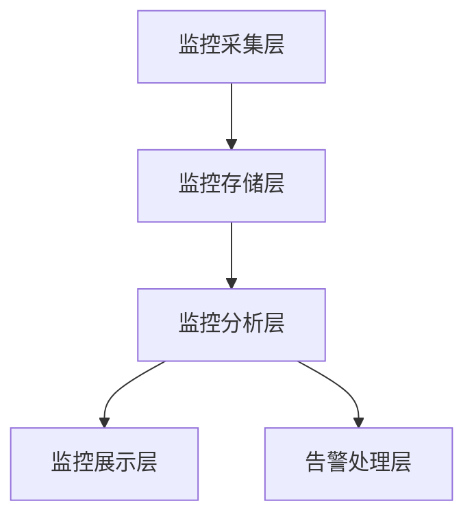

# 化妆品智慧监管平台监控运维方案

## 1. 监控体系设计

### 1.1 监控架构

### 1.2 监控维度
1. 基础设施监控
- 服务器监控（CPU、内存、磁盘、网络）
- 网络监控（带宽、延迟、丢包）
- 存储监控（容量、IO、响应时间）

2. 应用监控
- 服务可用性
- 接口响应时间
- 并发数
- 错误率
- JVM状态

3. 数据库监控
- 连接数
- 慢查询
- 锁等待
- 主从延迟

4. 业务监控
- 业务处理量
- 处理延迟
- 成功率
- 异常数

## 2. 告警管理

### 2.1 告警规则
1. 系统告警
- CPU使用率 > 80%
- 内存使用率 > 80%
- 磁盘使用率 > 85%
- 服务响应时间 > 3秒
- 错误率 > 1%

2. 业务告警
- 处理队列堆积 > 1000
- 业务处理超时 > 30秒
- 关键业务失败率 > 0.1%

### 2.2 告警级别
1. P1级（严重）
- 响应时间：5分钟内
- 解决时间：30分钟内
- 通知方式：电话+短信+邮件

2. P2级（重要）
- 响应时间：15分钟内
- 解决时间：2小时内
- 通知方式：短信+邮件

3. P3级（一般）
- 响应时间：30分钟内
- 解决时间：4小时内
- 通知方式：邮件

## 3. 日志管理

### 3.1 日志采集
1. 采集范围
- 应用日志
- 系统日志
- 访问日志
- 操作日志
- 安全日志

2. 采集策略
- 实时采集
- 定时采集
- 按需采集

### 3.2 日志分析
1. 实时分析
- 错误监控
- 性能分析
- 安全分析

2. 离线分析
- 趋势分析
- 容量规划
- 性能优化

## 4. 运维管理

### 4.1 变更管理
1. 变更流程
- 变更申请
- 变更评估
- 变更审批
- 变更实施
- 变更验证

2. 变更规范
- 重大变更提前3天申请
- 一般变更提前1天申请
- 变更时间避开业务高峰
- 准备回滚方案

### 4.2 应急处置
1. 应急预案
- 系统故障预案
- 网络故障预案
- 数据库故障预案
- 安全事件预案

2. 处置流程
- 故障发现
- 故障定位
- 故障处理
- 故障恢复
- 复盘总结

## 5. 容量规划

### 5.1 资源评估
1. 计算资源
- CPU使用趋势
- 内存使用趋势
- 存储使用趋势

2. 网络资源
- 带宽使用趋势
- 连接数趋势
- 流量趋势

### 5.2 扩容策略
1. 触发条件
- CPU使用率 > 70%持续1周
- 内存使用率 > 70%持续1周
- 存储使用率 > 80%
- 带宽使用率 > 70%持续1周

2. 扩容方案
- 垂直扩容：升级硬件配置
- 水平扩容：增加节点数量
- 优化扩容：系统性能优化

## 6. 安全运维

### 6.1 安全管理
1. 访问控制
- 账号管理
- 权限管理
- 操作审计

2. 安全监控
- 漏洞扫描
- 入侵检测
- 安全事件监控

### 6.2 数据安全
1. 数据备份
- 全量备份：每周一次
- 增量备份：每天一次
- 实时备份：重要数据

2. 灾备管理
- 灾备环境部署
- 灾备切换演练
- 数据恢复验证

## 7. 运维工具

### 7.1 监控工具
- Prometheus：系统监控
- Grafana：监控展示
- ELK：日志分析
- SkyWalking：APM监控

### 7.2 运维工具
- Jenkins：持续集成
- Ansible：自动化部署
- GitLab：代码管理
- Harbor：镜像仓库