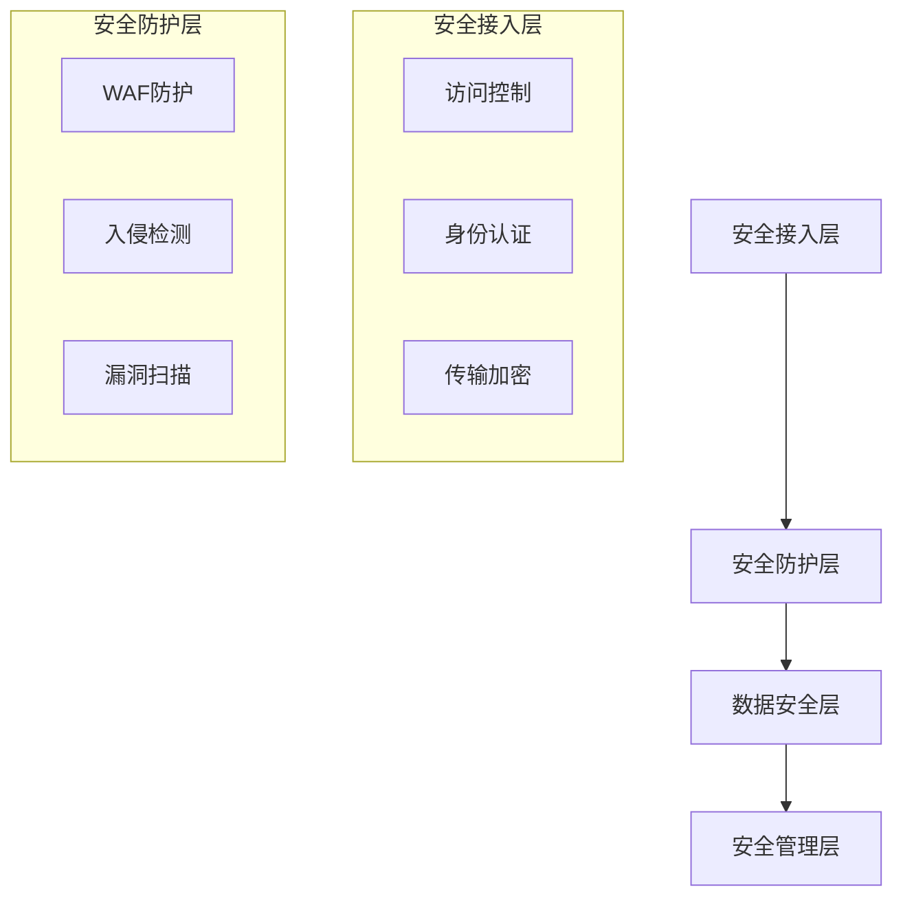

# 化妆品智慧监管平台安全防护补充方案

## 1. 安全架构设计

### 1.1 整体安全架构

### 1.2 安全技术体系
1. 网络安全
- 防火墙部署
- VPN接入
- 流量清洗
- 访问控制

2. 应用安全
- 身份认证
- 权限控制
- 数据加密
- 审计日志

## 2. 数据安全防护

### 2.1 数据分级管控
1. 数据分级
- 核心机密数据
- 重要敏感数据
- 内部一般数据
- 公开数据

2. 管控要求
- 访问权限控制
- 传输加密要求
- 存储加密要求
- 使用审计要求

### 2.2 安全防护措施
1. 数据存储安全
- 数据加密存储
- 数据备份保护
- 数据容灾备份
- 数据销毁机制

2. 数据传输安全
- SSL/TLS加密
- 数据签名校验
- 传输链路加密
- 访问控制策略

## 3. 安全运维管理

### 3.1 安全管理制度
1. 制度体系
- 安全管理制度
- 应急响应制度
- 业务连续性制度
- 审计管理制度

2. 运维规范
- 账号管理规范
- 变更管理规范
- 日志管理规范
- 应急处置规范

### 3.2 安全运维措施
1. 日常运维
- 安全巡检
- 漏洞扫描
- 补丁更新
- 安全审计

2. 应急响应
- 应急预案
- 响应流程
- 处置措施
- 恢复验证

## 4. 安全监控预警

### 4.1 监控体系
1. 安全监控
- 系统监控
- 网络监控
- 应用监控
- 数据监控

2. 预警规则
- 异常访问预警
- 攻击行为预警
- 数据泄露预警
- 系统异常预警

### 4.2 响应处置
1. 处置流程
- 事件发现
- 事件分析
- 事件处置
- 结果反馈

2. 应急预案
- 应急响应机制
- 快速处置方案
- 应急预案演练
- 持续优化改进

## 5. 等级保护实施

### 5.1 等保建设
1. 制度建设
- 安全制度
- 管理制度
- 操作规程
- 应急预案

2. 技术建设
- 安全技术措施
- 安全管理平台
- 安全运维工具
- 应急响应平台

### 5.2 持续改进
1. 安全评估
- 定期评估
- 漏洞扫描
- 渗透测试
- 风险评估

2. 整改优化
- 问题整改
- 方案优化
- 预案完善
- 持续改进