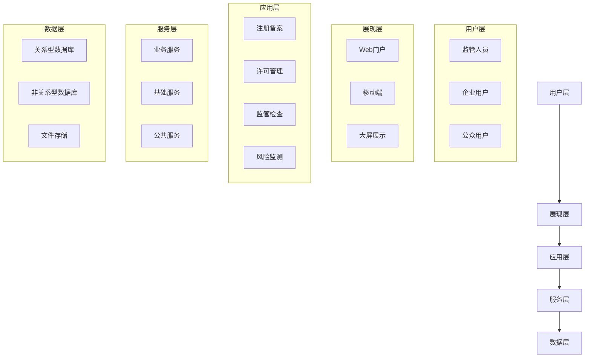
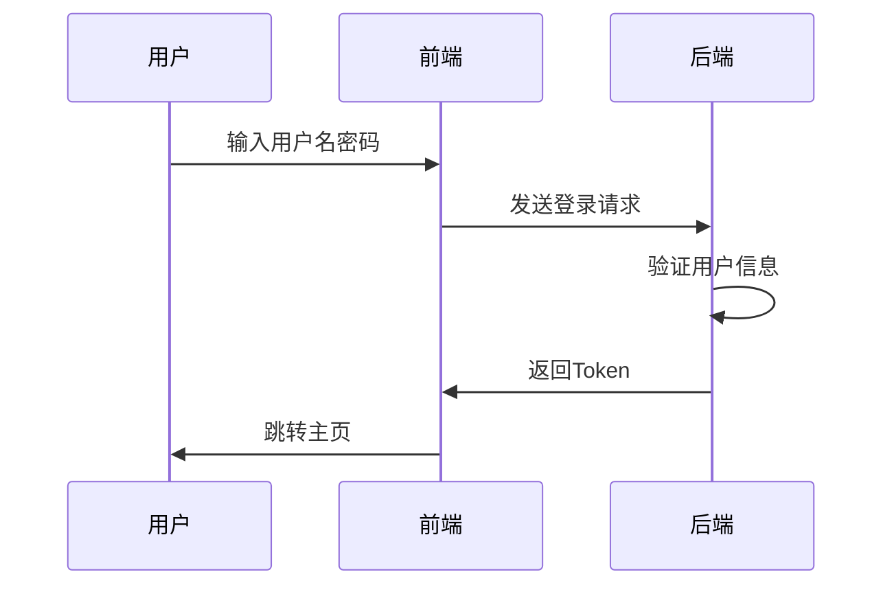
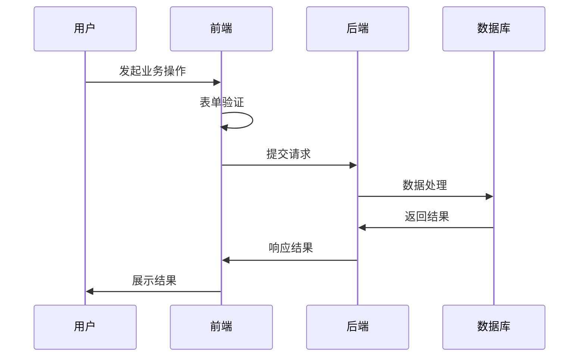

# 化妆品智慧监管平台系统详细设计文档

## 1. 系统总体架构设计

### 1.1 系统架构图

### 1.2 技术架构选型

#### 1.2.1 前端技术栈
1. 基础框架
- React 18.0+
- TypeScript 4.x
- Tailwind CSS 3.x

2. UI组件库
- Ant Design Pro
- ECharts 5.x
- AMap API

3. 工具库
- Axios
- Redux Toolkit
- React Router 6

#### 1.2.2 后端技术栈
1. 基础框架
- Spring Cloud Alibaba
- Spring Boot 2.7+
- MyBatis Plus

2. 中间件
- MySQL 8.0
- Redis 6.x
- RabbitMQ
- Elasticsearch 7.x

3. 微服务组件
- Nacos：注册中心和配置中心
- Sentinel：流量控制
- Seata：分布式事务
- Gateway：API网关

### 1.3 子系统架构

#### 1.3.1 注册备案子系统
1. 功能模块
- 企业注册管理
- 产品备案管理
- 变更管理
- 注销管理

2. 技术特点
- 分布式事务处理
- 文件存储服务
- 工作流引擎

#### 1.3.2 许可管理子系统
1. 功能模块
- 许可申请管理
- 审批流程管理
- 证照管理
- 变更管理

2. 技术特点
- 流程引擎集成
- 电子证照管理
- 审批规则引擎

#### 1.3.3 监管检查子系统
1. 功能模块
- 检查计划管理
- 现场检查管理
- 问题整改管理
- 监管档案管理

2. 技术特点
- 移动端支持
- 离线数据同步
- GIS地图集成

## 2. 前端UI设计

### 2.1 页面布局设计
1. 整体布局
- Header：顶部导航栏
- Sider：左侧菜单栏
- Content：主要内容区
- Footer：底部信息栏

2. 响应式设计
- Desktop：≥1200px
- Tablet：≥768px
- Mobile：<768px

### 2.2 交互流程设计
1. 用户认证流程

2. 业务操作流程

### 2.3 组件设计
1. 基础组件
- Button：按钮组件
- Form：表单组件
- Table：表格组件
- Modal：弹窗组件

2. 业务组件
- SearchForm：搜索表单
- DetailCard：详情卡片
- StatusTag：状态标签
- FileUpload：文件上传

3. 容器组件
- PageContainer：页面容器
- TableList：列表容器
- DetailDrawer：详情抽屉
- FilterBar：筛选栏