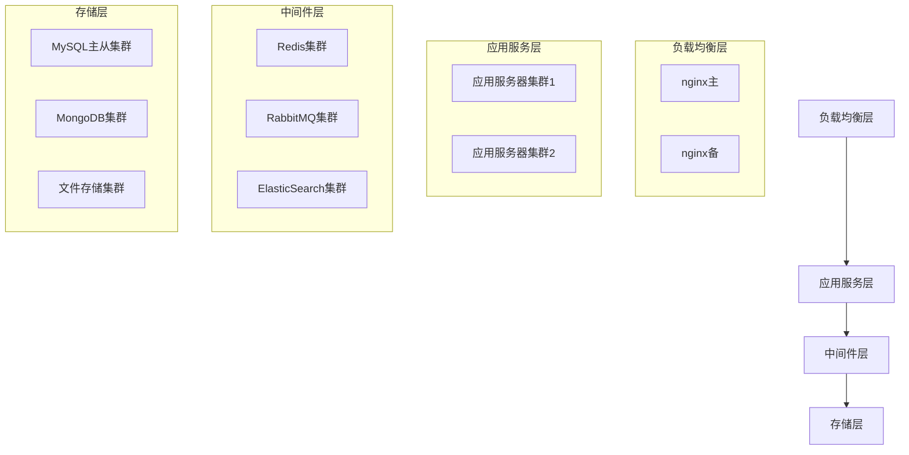

# 化妆品智慧监管平台部署架构设计

## 1. 部署拓扑设计

### 1.1 总体部署架构


### 1.2 网络架构设计
1. 网络分区
- DMZ区：负载均衡、接入网关
- APP区：应用服务器
- DB区：数据库服务器
- 存储区：文件存储服务器

2. 安全设计
- 防火墙隔离
- VPN访问
- 安全审计

## 2. 服务器配置

### 2.1 硬件配置清单

#### 2.1.1 应用服务器
```plaintext
配置要求：
- CPU: 16核 Intel Xeon
- 内存: 32GB DDR4
- 硬盘: 500GB SSD
- 网卡: 万兆网卡
数量: 6台
```

#### 2.1.2 数据库服务器
```plaintext
配置要求：
- CPU: 32核 Intel Xeon
- 内存: 64GB DDR4
- 硬盘: 2TB SSD
- 网卡: 万兆网卡
数量: 4台
```

#### 2.1.3 存储服务器
```plaintext
配置要求：
- CPU: 16核 Intel Xeon
- 内存: 32GB DDR4
- 硬盘: 10TB SAS
- 网卡: 万兆网卡
数量: 2台
```

### 2.2 软件环境配置

#### 2.2.1 操作系统配置
1. 系统选型
- CentOS 7.9
- 内核版本: 3.10.0
- 文件系统: XFS

2. 系统优化
- 最大文件打开数
- 网络参数优化
- 磁盘IO调优

#### 2.2.2 中间件配置
1. Nginx配置
```nginx
worker_processes 8;
worker_connections 10240;
keepalive_timeout 60;
client_max_body_size 10M;
```

2. JVM配置
```plaintext
-Xms4096m
-Xmx4096m
-XX:MetaspaceSize=256m
-XX:MaxMetaspaceSize=512m
-XX:+UseG1GC
```

## 3. 监控运维方案

### 3.1 监控体系
1. 基础监控
- 服务器监控
- 网络监控
- 存储监控

2. 应用监控
- 服务监控
- 接口监控
- 性能监控

3. 业务监控
- 交易监控
- 用户监控
- 风险监控

### 3.2 告警策略
1. 告警级别
- P1级：严重故障
- P2级：重要告警
- P3级：一般告警

2. 告警方式
- 短信告警
- 邮件告警
- 电话告警

### 3.3 运维流程
1. 日常运维
- 巡检制度
- 变更管理
- 故障处理

2. 应急处置
- 故障升级
- 应急响应
- 复盘总结

## 4. 灾备方案

### 4.1 数据备份
1. 备份策略
- 全量备份
- 增量备份
- 差异备份

2. 备份周期
- 日备份
- 周备份
- 月备份

### 4.2 灾难恢复
1. 恢复目标
- RTO: 4小时
- RPO: 1小时

2. 恢复流程
- 故障确认
- 数据恢复
- 服务恢复
- 验证确认

## 5. 安全防护

### 5.1 网络安全
1. 访问控制
- ACL策略
- IP白名单
- 端口管理

2. 入侵防护
- WAF防护
- IDS/IPS
- DDoS防护

### 5.2 数据安全
1. 传输安全
- SSL证书
- 数据加密
- VPN通道

2. 存储安全
- 数据加密
- 访问控制
- 审计日志