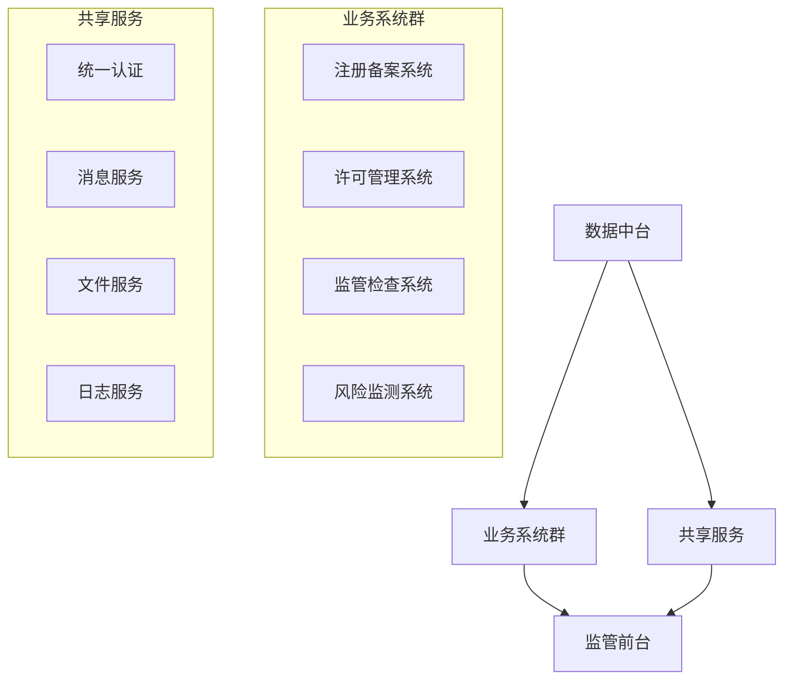

# 化妆品智慧监管平台系统集成最终设计文档

## 1. 系统集成总体架构

### 1.1 集成框架

### 1.2 集成模式
1. 数据集成
- 数据库集成
- 文件集成
- 消息集成

2. 服务集成
- REST API集成
- WebService集成
- 消息队列集成

## 2. 接口规范定义

### 2.1 API设计规范
1. REST API规范
- URL命名规范
- HTTP方法使用规范
- 参数定义规范
- 响应格式规范

2. 安全规范
- 认证方式
- 加密要求
- 访问控制

### 2.2 数据交换规范
1. 数据格式
- JSON格式
- XML格式
- 二进制格式

2. 交换协议
- HTTP/HTTPS
- TCP/IP
- WebSocket

## 3. 系统间集成方案

### 3.1 系统集成清单
1. 内部系统集成
- 注册备案系统集成
- 许可管理系统集成
- 监管检查系统集成
- 风险监测系统集成

2. 外部系统集成
- 国家局系统集成
- 省局系统集成
- 政务服务平台集成

### 3.2 集成实现方式
1. 接口对接
- 同步接口调用
- 异步接口调用
- 批量数据交换

2. 数据共享
- 实时数据同步
- 定时数据同步
- 按需数据同步

## 4. 安全保障方案

### 4.1 安全防护
1. 接口安全
- 接口认证
- 数据加密
- 访问控制

2. 传输安全
- HTTPS加密
- VPN通道
- 数据签名

### 4.2 安全管理
1. 安全审计
- 操作日志
- 访问日志
- 安全事件

2. 应急处置
- 应急预案
- 故障处理
- 灾备切换

## 5. 监控管理方案

### 5.1 监控体系
1. 系统监控
- 服务监控
- 接口监控
- 性能监控

2. 业务监控
- 业务处理监控
- 数据同步监控
- 异常情况监控

### 5.2 预警处理
1. 预警规则
- 性能预警
- 业务预警
- 安全预警

2. 处理流程
- 问题发现
- 问题处理
- 结果反馈

## 6. 部署实施方案

### 6.1 部署架构
1. 环境部署
- 开发环境
- 测试环境
- 生产环境

2. 网络部署
- 网络分区
- 安全隔离
- 负载均衡

### 6.2 实施步骤
1. 实施准备
- 环境准备
- 人员准备
- 方案确认

2. 实施过程
- 系统部署
- 接口联调
- 系统测试
- 系统验收

## 7. 运维保障方案

### 7.1 运维管理
1. 日常运维
- 系统巡检
- 性能优化
- 故障处理

2. 应急处置
- 故障响应
- 问题处理
- 应急恢复

### 7.2 持续优化
1. 性能优化
- 接口优化
- 数据优化
- 流程优化

2. 功能优化
- 需求分析
- 方案设计
- 优化实施